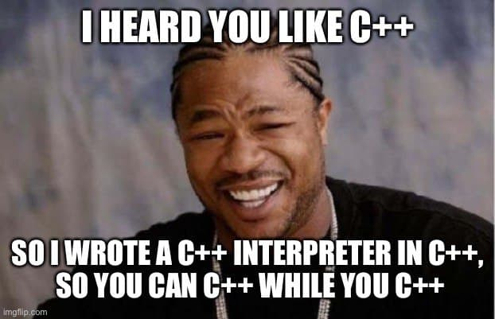
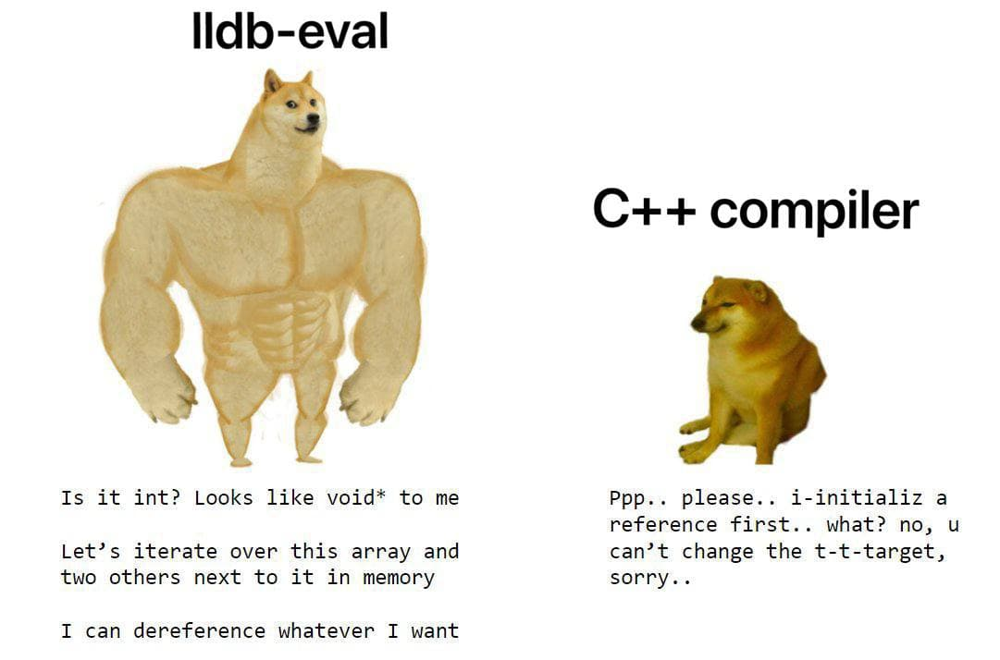

Expression evaluation is an integral part of any modern debugger. It allows the user to inspect the program state using the familiar syntax of the target language, as well as perform modifications to the target process (if the side-effects are allowed). If you have ever used command-line debuggers, you're probably familiar with it via commands like `print`/`call` in GDB or `expr`/`p` in LLDB. It is also used extensively by the IDEs to support typical UI workflows: [Immediate Window](https://docs.microsoft.com/en-us/visualstudio/ide/reference/immediate-window?view=vs-2019), [Watch Window](https://docs.microsoft.com/en-us/visualstudio/debugger/watch-and-quickwatch-windows?view=vs-2019), hovering over a variable, custom data visualizers (see [NatVis](https://docs.microsoft.com/en-us/visualstudio/debugger/create-custom-views-of-native-objects?view=vs-2019)), etc.

```c++
* thread #1, queue = 'com.apple.main-thread', stop reason = step in
    frame #0: 0x0000000100003fb2 a.out`main at zero.cc:3:12
   1    int main() {
   2        int i = 1;
-> 3        return i;
   4    }

(lldb) expr i + 1
(int) $0 = 2
(lldb) expr (float)i + static_cast<int>(1.4) * 3
(float) $1 = 4
```

^ example of expression evaluation in LLDB

The expression evaluator can be implemented as an interpreter of the target language (that's what GDB does for C++, for example) or by re-using the bits of the compiler infrastructure (e.g. LLDB uses Clang, C# debugger in Visual Studio uses Roslyn). Often it's a combination, when the compiler can be used as a library and behaves differenly when invoked by the debugger (this is how C# worked in earlier versions of Visual Studio, [twitter thread](https://twitter.com/AnsonHorton/status/1343901623962103809)).

> If you're interesting in the unusual debugger architectures, read about [ACID](https://plan9.io/sys/doc/acidpaper.html) -- the debugger implemented as a language interpreter with specialized primitives that provide debugger support.

---

[LLDB](https://lldb.llvm.org/) is the debugger component of the LLVM project. It is built as a set of reusable components which extensively use existing libraries from LLVM, such as the Clang expression parser and LLVM disassembler[^1].

LLDB has a very powerfull built-in expression evaluator, powered by [Clang](https://clang.llvm.org/). It can handle almost any valid C++ as well as perform function calls. But the downside of this power is poor performance, especially for large programs with lots of debug information. This is not as critical for interactive use, but doesn't work well for implementing IDE integrations. For example, [Stadia debugger for Visual Studio](https://github.com/googlestadia/vsi-lldb) evaluates dozens and hundreds of expressions for every "step", so it has to be fast. Nobody likes slow debuggers!

This is where [lldb-eval](https://github.com/google/lldb-eval) comes in. It's a library for evaluating C++ like expressions in the debugger context, built with performance in mind. It's designed around LLDB, has very similar API and in many cases can be used as a drop-in replacement. The primary use-case is IDE integration (namely, [Stadia for Visual Studio](https://github.com/googlestadia/vsi-lldb)). The rest of this post is about the library architecture and design decisions behind it.

`lldb-eval` is open-source and available on GitHub -- <https://github.com/google/lldb-eval>.

## Overview



Basically `lldb-eval` is an interpreter for a subset of C++, written in C++. Like a typical interpreter it has a parser that produces an expression AST and an evaluator that evaluates that AST. The parser performs type-checking and semantics analysis, while the evaluator implements the runtime control flow analysis.

## Expression language

The expression language is a subset of C++ ([EBNF grammar](https://github.com/google/lldb-eval/blob/master/docs/expr-lang.ebnf)). The grammar supports all basic C++ features: arithmetic operators, members access, C-style and C++-style casts, function calls (for supported debugger intrinsics). Overall the set of features is aimed to be compatible with other debuggers and [NatVis rules](https://docs.microsoft.com/en-us/visualstudio/debugger/create-custom-views-of-native-objects?view=vs-2019#BKMK_Expressions_and_formatting).

## Parser

The first core component in `lldb-eval` is `Parser` ([parser.h](https://github.com/google/lldb-eval/blob/master/lldb-eval/parser.h)). It's a classic [recursive descent parser](https://en.wikipedia.org/wiki/Recursive_descent_parser) with several modifications to accomodate for C++ grammar. Since C++ cannot be expressed in pure [LL grammar](https://en.wikipedia.org/wiki/LL_grammar), the parser performs limited look-ahead and has the ability to do tentative parsing with rollbacks. The input data is limited to one C++ _expression_, although it can be multi-line and arbitrarily long.

The parser relies on `clang` library to do the lexing and preprocessing (using `clang::Preprocessor`) and then processes the stream of C++ token to build an expression [AST](https://en.wikipedia.org/wiki/Abstract_syntax_tree). The AST is annotated, meaning that the parser resolves the type for every node and performs the type checking and semantic analysis. The parser tries to produce rich diagnostics (with source locations whenever possible), most errors messages are similar to `clang`:

```c++
> test::foo.bar->baz.x
<expr>:1:14: member reference type 'test::Bar' is not a pointer; did you mean to use '.'?
test::foo.bar->baz.x
             ^

> test::foo.bar.baz + 2
<expr>:1:19: invalid operands to binary expression ('test::Baz' and 'int')
test::foo.bar.baz + 2
                  ^
```

### Identifier resolution

Unlike the regular compiler, `lldb-eval` resolves the expression in the debugger context and uses the debug information from the target process (DWARF, PDB) to resolve the identifiers (variables, types). If the binary being debugged doesn't have the debug information and symbols, there isn't much `lldb-eval` can do about it. Same goes for binaries built with higher optimization levels -- some symbols might be optimized away (e.g. unused types and variables are first candidates for removal) and the expression evaluator will not be able to use them. These restrictions are not really specific for `lldb-eval`. If some variable is optimized away, you will not be able to see its value using commands like `frame variable` either.

To resolve an identifier, it's not sufficient to just perform a name lookup (and, unfortunately, that's basically the API we have -- `FindTypes(name)` and `FindVariables(name)`). C++ uses namespaces and classes/structs to define scoping rules. E.g. `int foo::bar` is different from `int baz::bar` (`foo` and `baz` being namespaces). When the parser encounters an identifier `bar` it needs to resolve it. Is it a _variable_ from `foo`? Or maybe it's a _type_ defined in `other_namespace`? In C++ it's possible to declare variables and types almost anywhere, so a proper resolver should take the hierarchical scoping rules into account:

```c++
using myint = int;

void func() {
  // `(myint)1.5` is 1
}

namespace ns {

using myint = double;

void func() {
  // `(myint)1.5` is 1.5

  // Credit @cor3ntin -- https://twitter.com/cor3ntin/status/1373773782700146689
  for (typedef int myint; myint x : {1.5}) {
    // `(myint)1.5` is 1 😱
  }
}

}
```

But C++ grammar is even more complicated than that and allows for a lot of ambiguities. Depending on the surrounding context the same expression can mean very different things. Consider the expression `(myint)-1`. Your first (very reasonable) guess was probably that it's a cast of `-1` to the type `myint`. However that can also be an arithmetic operation if `myint` is a variable!

```c++
int myint = 1;

void func_1() {
  // `(myint)-1` is 0
}

void func_2() {
  using myint = uint16_t;
  // `(myint)-1` is 65535 😱
}
```

The C++ _compiler_ can easily resolve `myint`, because it knows exactly what the current scope is. All shadowing operations have already been applied (i.e. `using myint` shadowed `int myint`), so the resolution is unambiguous. The parser in `lldb-eval`, however, doesn't have the scope information, it can only lookup identifiers by their names. The best we can do is to get the current scope (e.g. `int foo::bar()`) and then look for the "closest" symbol in the hierarchy of this scope. For example, if the current frame is `int ns::Class::foo()`, we can look for (`ns::Class::foo::bar`, `ns::Class::bar`, `ns::bar`, `::bar`) and take the first match.

There are other limitations we face when using public LLDB API. For example, static const members and enum constants are not currently being indexed by LLDB, even though they're present in the DWARF debug info. There are patches to improve this, but it's still work in progress:

* [Lookup unscoped enumeration members](https://reviews.llvm.org/D92643)
* [Lookup static const members](https://reviews.llvm.org/D94077)

### Semantic analysis

The semantic analysis in `lldb-eval` is heavily inspired by other C++ compilers (GCC, Clang) and, at its core, is very similar to what they do. The parser resolves the types and performs all kinds of checks to verify that the given expression is valid in the _current context_. This includes simple checks like detecting addition of incompatible types (e.g. `int` and `Foo`), as well as more complicated [integral promotions](https://en.cppreference.com/w/cpp/language/implicit_conversion#Numeric_promotions), implicit type conversions and `lvalue/rvalue` control flow analysis.

That said, the parser has a number of deliberate deviations from C++ spec due to the fact that the expression interpreter in the debugger has a slightly different goal than the compiler. The compiler is meant to verify that the code is correct and produce the most optimal output, while still maintaining all the invariants of the language specification. The debugger, however, aims to help the developer in inspecting the program state.

For example, in C++ it is illegal to compare pointers with numeric literals except for literal zero:

```c++
int* p = 0;

p == 1;  // error: comparison between pointer and integer ('int *' and 'int')
p == 0;  // OK, literal zero is allowed
```

The debuggers usually allow this (the example is LLDB, but GDB and MSVC do the same):

```c++
Process 32964 stopped
* thread #1, queue = 'com.apple.main-thread', stop reason = step in
    frame #0: 0x0000000100003fb5 a.out`main at zero.cc:3:5
   1    int main() {
   2        int* p = 0;
-> 3        return 0;
   4    }

(lldb) p p == 1
(bool) $0 = false
(lldb) p p == 0
(bool) $1 = true
```

Clang [explicitly allows this](https://github.com/llvm/llvm-project/blob/5b2d8503d1d4b925e30fd2b91f97bfd625f03157/clang/lib/Sema/SemaExpr.cpp#L11971-L11972) if the expression is being parsed in the debugger context. Same goes for [accessing private and protected members](https://github.com/llvm/llvm-project/blob/5b2d8503d1d4b925e30fd2b91f97bfd625f03157/clang/lib/Sema/SemaExprMember.cpp#L1421) of classes and structs. _Of course_ if someone types `foo->x_`, they don't expect to get `'x_' is a private member of 'Foo'`. That's why `lldb-eval` is less strict than the compiler and tries to do what the user expects in the given context.



## Interpreter

The second core component in `lldb-eval` is the `Interpreter` ([eval.h](https://github.com/google/lldb-eval/blob/master/lldb-eval/eval.h)). It takes the AST produced by the parser and recursively evaluates it. Typically interpreters convert the AST to some kind of [bytecode](https://en.wikipedia.org/wiki/Bytecode) or [IR](https://en.wikipedia.org/wiki/Intermediate_representation) first, but `lldb-eval` skips this step for simplicity.

Since the parser is guaranteed to produce a _valid_ AST (or give a reasonable error), the `Interpreter` makes an assumption of correctness -- all the types match, all casts are correct, all functions have correct number of arguments, etc. This doesn't prevent _runtime_ errors though. For example, one can still dereference a null pointer -- `*(int*)0 + 1`. The parser will be happy, but the interpreter will have to deal with zero pointer.

The interpreter implements a number of optimizations related to UB (undefined behavior) described in C++ specification. A little known fact, it's actually perfectly legal to dereference a null pointer _as long as the result of the dereference is not used_. For example, this is well-formed C++:

```c++
int x = 42;
int* p = &( true ? *(int*)0 : x );

// `p + 1` is 1;
```

The interpreter performs flow control analysis, detects when the result of the dereference is not used and eliminates the "pair" operations of `&*`. Same logic also applies for member access (which is _basically_ a dereference):

```c++
auto p = &((Foo*)0)->foo_;

// `p` is the offset of `foo_` in `Foo`.
```

Implementing this properly, however, is more complicated, because in general it's not possible to calculate the offset "statically". If the object in question has virtual base classes, the debug information might not contain all the required information and the offset should be calculated at runtime using the [vtable](https://en.wikipedia.org/wiki/Virtual_method_table). This is doable, but not yet implemented in `lldb-eval`.

## API

`lldb-eval` has a minimalistic [API](lldb-eval/api.h) which is very similar to LLDB API (not surprising, given that it builds on top on `LLDB`). The basic method looks like this:

```c++
lldb::SBValue EvaluateExpression(
  lldb::SBFrame frame, const char* expression, lldb::SBError& error);
```

Usually you'd want the stack frame where the program is currently stopped, but it's possible to use any valid one (e.g. from another thread or to inspect the variables of the caller function).

There's a option of using `lldb::SBValue` instead of `lldb::SBFrame`, then the expression is evaluated in the context of the given object:

```c++
lldb::SBValue EvaluateExpression(
  lldb::SBValue scope, const char* expression, lldb::SBError& error);
```

For example, `this->foo_` or just `foo_` will refer to the member of the context object, not the variable in the current stack frame. This is very useful when evaluating custom visualization logic like [NatVis](https://docs.microsoft.com/en-us/visualstudio/debugger/create-custom-views-of-native-objects).

### Maintaning state

`lldb-eval` is stateless (and thread-safe), but sometimes it's useful to have some state that the expressions can access and modify. For example, in NatVis [CustomListItems](https://docs.microsoft.com/en-us/visualstudio/debugger/create-custom-views-of-native-objects?view=vs-2019#customlistitems-expansion) allows you to declare variables that can be modified by the expression. Typical examples -- a counter or a pointer to a bucket in hash-table.

Both versions of `EvaluateExpression` allow passing of a list of external identifiers/values that can be used by the expression. This makes it possible to have a state between the expression evaluations, while keeping the library stateless:

```c++
lldb::SBError ignore;
lldb::SBValue counter = lldb_eval::EvaluateExpression(frame, "10", ignore);

lldb_eval::ContextVariable var;
var.name = "counter";
var.value = counter;

lldb_eval::ContextVariableList vars;
vars.data = &var;
vars.size = 1;

while (counter.GetValueAsUnsigned() > 0) {
  lldb_eval::EvaluateExpression(frame, "--counter", vars, ignore);
}
```

The code above creates a `counter` with initial value of `10` and then decrements it in a loop.

[^1]: https://en.wikipedia.org/wiki/LLDB_(debugger)
