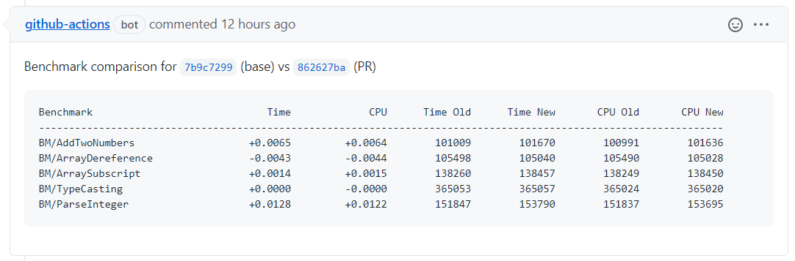
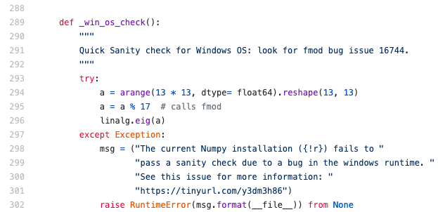

Benchmarks are often underestimated and don't get the same attention as tests. However ["performance is a feature"](https://blog.codinghorror.com/performance-is-a-feature/) and when something is not tested it might as well be just broken. If the performance is not measured/tracked regressions are inevitable.

Modern tooling makes it really easy to write benchmarks. Some languages have built-in support, for example, Rust comes with `cargo bench` ([docs](https://doc.rust-lang.org/cargo/commands/cargo-bench.html)) and Go has `go test -bench` ([docs](https://golang.org/pkg/testing/#hdr-Benchmarks)). For C++ there is [google/benchmark](https://github.com/google/benchmark) -- not as streamlined as having it built into the language infrastructure, but still definitely worth the effort.

Last week I was looking into setting up some automated benchmarking for my project [google/lldb-eval](https://github.com/google/lldb-eval). It's written in C++ (and already affiliated with Google 😃 ), so [google/benchmark](https://github.com/google/benchmark) feels like a natural choice. For the "automated" part I was thinking about a simple GitHub Action -- for every pull request run the benchmark on for BASE and HEAD commits, compare the results and post them as a review comment.

The final result looks like [this](https://github.com/google/lldb-eval/pull/131#issuecomment-846019771) and the rest of the post is about how I got there:



---

First we need to write some benchmarks. As I mentioned ealier, for that I'm using [google/benchmark](https://github.com/google/benchmark) -- a library to benchmark code snippets, very similar to unit tests. The basic example as simple as:

```c++
#include <benchmark/benchmark.h>

static void BM_SomeFunction(benchmark::State& state) {
  // Perform setup here
  for (auto _ : state) {
    // This code gets timed
    SomeFunction();
  }
}
// Register the function as a benchmark
BENCHMARK(BM_SomeFunction);
```

Real-life examples might require one-time setup and teardown logic (e.g. launch a process, attach the debugger, shutdown everything at the end), which can be implemented via [Fixtures](https://github.com/google/benchmark/#fixtures). There are more advanced features, but I'm not using them at the moment. The current set of benchmarks for `lldb-eval` can be found in [lldb-eval/eval-benchmarks.cc](https://github.com/google/lldb-eval/blob/4317381e1fa6b97aa661d8f274121ca4fd5fe889/lldb-eval/eval_benchmark.cc).

Using [google/benchmark](https://github.com/google/benchmark) with Bazel is pretty straightforward. The library already has support for building with Bazel ([BUILD.bazel](https://github.com/google/benchmark/blob/master/BUILD.bazel)), so you just need to declare the dependency in your `WORKSPACE` file and then you can use it as any other third-party library.

```c++
# WORKSPACE
http_archive(
    name = "com_google_benchmark",
    sha256 = "bdefa4b03c32d1a27bd50e37ca466d8127c1688d834800c38f3c587a396188ee",
    strip_prefix = "benchmark-1.5.3",
    urls = ["https://github.com/google/benchmark/archive/v1.5.3.zip"],
)

# BUILD
cc_binary(
    name = "benchmark",
    srcs = ["benchmark.cc"],
    deps = [
        ":your_library",
        "@com_google_benchmark//:benchmark_main",
    ],
)
```

The `benchmark` target here is a regular `cc_binary`, so you can run it with `bazel run`:

```bash
> bazel run -c opt :benchmark
...
----------------------------------------------------------
Benchmark                Time             CPU   Iterations
----------------------------------------------------------
BM_SomeFunction      23141 ns        23077 ns        30307
```

---

Now we need to figure out how to make this into some automated process. Searching the GitHub Marketplace yielded a `GitHub Action for Continuous Benchmarking` ([rhysd/github-action-benchmark](https://github.com/rhysd/github-action-benchmark)). It seems to support a number of languages and frameworks (Rust, Go, C++, JS, Python) as well as polyglot projects (i.e. multiple languages in the same repository) and has a handful of features -- e.g. it can record all your measurements and display nice charts showing the performance over time -- <https://rhysd.github.io/github-action-benchmark/dev/bench>.

However it doesn't seem to support the simplest workflow I wanted -- just run the benchmark for incoming changes and show if there are performance regressions or improvements. Moreover the documentation explicitly doesn't recommend to run the action on pull requests:

> Please ensure that your benchmark workflow runs only on your branches. Please avoid running it on pull requests. If a branch were pushed to GitHub pages branch on a pull request, anyone who creates a pull request on your repository could modify your GitHub pages branch.

I guess it's time to write some YAML :)

**TL;DR** the final workflow is here -- [lldb-eval/.github/workflows/benchmarks.yml](https://github.com/google/lldb-eval/blob/4317381e1fa6b97aa661d8f274121ca4fd5fe889/.github/workflows/benchmarks.yml). Below I will cover the most interesting parts.

The basic setup is trivial: trigger on pull requests, run on Ubuntu, checkout the repo, create some temporary files for intermediate results, etc. The interesting part starts with running the benchmarks. We need to run the benchmarks twice: for the BASE (i.e. parent) and for the HEAD ref (i.e. pull request). In `git` it's easy to switch between commits -- sounds like a job for the `git checkout` command:

```bash
# Run for BASE
git checkout ${{ github.event.pull_request.base.sha }}
bazel run lldb-eval:eval_benchmark > base.json

# Run for HEAD
git checkout ${{ github.event.pull_request.head.sha }}
bazel run lldb-eval:eval_benchmark > head.json
```

> Some parameters are omitted for simplicity, see full script in [benchmarks.yml](https://github.com/google/lldb-eval/blob/4317381e1fa6b97aa661d8f274121ca4fd5fe889/.github/workflows/benchmarks.yml)

For comparing two benchmark runs [google/benchmark](https://github.com/google/benchmark) provides a script [tools/compare.py](https://github.com/google/benchmark/blob/db2de74cc8c34131a6f673e35751935cc1897a0d/tools/compare.py). Sounds like exactly what we need! When using it with GitHub Actions I've encountered a small hiccup, however. Just calling `bazel run //tools:compare` fails with a quite cryptic error:

```bash
bazel run //tools:compare -- --no-color benchmarks base.json head.json
```

```python
Traceback (most recent call last):
  File "/home/runner/.cache/bazel/_bazel_runner/77c7513313c82b78a5db5d85413329b8/execroot/com_github_google_benchmark/bazel-out/k8-py2-fastbuild/bin/tools/compare.runfiles/com_github_google_benchmark/tools/compare.py", line 13, in <module>
    from gbench import util, report
  File "/home/runner/work/lldb-eval/lldb-eval/google_benchmark/tools/gbench/report.py", line 8, in <module>
    from scipy.stats import mannwhitneyu
  File "/home/runner/.cache/bazel/_bazel_runner/77c7513313c82b78a5db5d85413329b8/execroot/com_github_google_benchmark/bazel-out/k8-py2-fastbuild/bin/tools/compare.runfiles/py_deps/pypi__scipy/scipy/__init__.py", line 61, in <module>
    from numpy import show_config as show_numpy_config
  File "/home/runner/.cache/bazel/_bazel_runner/77c7513313c82b78a5db5d85413329b8/execroot/com_github_google_benchmark/bazel-out/k8-py2-fastbuild/bin/tools/compare.runfiles/py_deps/pypi__numpy/numpy/__init__.py", line 292
SyntaxError: Non-ASCII character '\xef' in file /home/runner/.cache/bazel/_bazel_runner/77c7513313c82b78a5db5d85413329b8/execroot/com_github_google_benchmark/bazel-out/k8-py2-fastbuild/bin/tools/compare.runfiles/py_deps/pypi__numpy/numpy/__init__.p on line 293, but no encoding declared; see http://python.org/dev/peps/pep-0263/ for details
```

Hmmm, what is this character `'\xef'`?? I don't see anything suspicious ([link](https://github.com/numpy/numpy/blob/6d7b8aaed5ae9f0435764675ebac8c9ada06738f/numpy/__init__.py#L292)):



Let's try downloading this file and look what's actually there:

```python
In [1]: r = requests.get('https://raw.githubusercontent.com/numpy/numpy/6d7b8aaed5ae9f0435764675ebac8c9ada06738f/numpy/__init__.py')

In [2]: lines = r.content.split(b'\n')

In [3]: lines[290]
Out[3]: b'        Quick Sanity check for Windows OS: look for fmod bug issue 16744.\n'

In [4]: lines[291]
Out[4]: b'\xef\xbf\xbc       """\n'
```

... What the heck? At least this matches the error message `Non-ASCII character '\xef' ...`. `\xef\xbf\xbc` is `\uFFFC` in Unicode and means [OBJECT REPLACEMENT CHARACTER](https://codepoints.net/U+FFFC?lang=en). In this particular case it looks like just a mistake. In Python 3 the source files are implicitly treated as UTF8 and this symbol is ignored. In Python 2 the default encoding is ASCII, hence the error.

The Bazel rule builds and runs the script with `python_version = "PY2"` ([src](https://github.com/google/benchmark/blob/db2de74cc8c34131a6f673e35751935cc1897a0d/tools/BUILD.bazel#L15)), but the versions of `numpy` and `scipy` defined in the requirements have already dropped support for Python 2. Luckily `compare.py` is Python 3 compatible, so there we can just replace `PY2->PY3` with a sed-spell:

```bash
sed -i 's/PY2/PY3/g' tools/BUILD.bazel
```

The comparison step in the GitHub Action now looks like this:

```bash
sed -i 's/PY2/PY3/g' tools/BUILD.bazel
bazel run //tools:compare -- --no-color benchmarks base.json head.json > cmp_results
```

Now that we've managed to run the benchmarks and get the comparison results the only thing left is to post the results somewhere. I've decided to submit the results as a comment to the pull request being tested. GitHub supports Markdown in comments, so we can render a nice table with some links:

```bash
# Sometime earlier...
echo "BASE_SHA=$(echo ${{ github.event.pull_request.base.sha }} | cut -c1-8)" >> $GITHUB_ENV
echo "HEAD_SHA=$(echo ${{ github.event.pull_request.head.sha }} | cut -c1-8)" >> $GITHUB_ENV
echo "PR_COMMENT=$(mktemp)" >> $GITHUB_ENV

# Format the comment.
echo 'Benchmark comparison for [`${{ env.BASE_SHA }}`](${{ github.event.repository.html_url }}/commit/${{ github.event.pull_request.base.sha }}) (base) vs [`${{ env.HEAD_SHA }}`](${{ github.event.repository.html_url }}/commit/${{ github.event.pull_request.head.sha }}) (PR)' >> pr_comment
echo '```' >> pr_comment
tail -n +2 cmp_results >> pr_comment  # Skip the first line saying "Comparing XX to YY"
echo '```' >> pr_comment
cat pr_comment > ${{ env.PR_COMMENT }}
```

For actually posting the comment we can use [actions/github-script](https://github.com/actions/github-script):

```yaml
- name: 'Comment PR'
  uses: actions/github-script@v4.0.2
  with:
    github-token: ${{ secrets.GITHUB_TOKEN }}
    script: |
      github.issues.createComment({
        issue_number: context.issue.number,
        owner: context.repo.owner,
        repo: context.repo.repo,
        body: require('fs').readFileSync('${{ env.PR_COMMENT }}').toString()
      });
```

Again, the final workflow is available here -- [lldb-eval/.github/workflows/benchmarks.yml](https://github.com/google/lldb-eval/blob/4317381e1fa6b97aa661d8f274121ca4fd5fe889/.github/workflows/benchmarks.yml).

---

Happy benchmarking!
