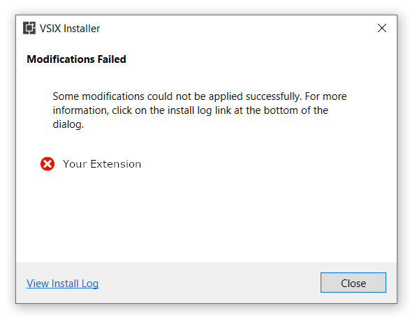

Visual Studio extensions are typically distributed via [VSIX packages](https://docs.microsoft.com/en-us/visualstudio/extensibility/anatomy-of-a-vsix-package?view=vs-2019). Visual Studio comes with an installer `vsixinstaller.exe`, which handles the actuall installation process. When you download the VSIX file from the extension gallery and then double-click it or when you install the extension from Visual Studio via the "Extensions and Updates" menu the above mentioned installer is invoked and does all the work. It's also possible to use `vsixinstaller.exe` directly if you need to install the extensions programmatically (e.g. in a script that sets up a new developer machine).

Sometimes the extension comes as a part of some SDK along with many other components (e.g. [NVIDIA Nsight](https://developer.nvidia.com/nsight-visual-studio-edition)). Some of those components may be required for the extension to work properly or maybe you just want your users to install everything in one go. In this case it's common to have an installer (typically MSI) that bundles all components including the Visual Studio extension.

Now there are a couple of ways to install the Visual Studio extension from the MSI installer. First of all you can just invoke `vsixinstaller.exe <my-extension>.vsix`. This will require you to figure out a bunch of details though: find the Visual Studio installations, figure out which ones are compatible with your extension, provide correct flags to `vsixinstaller.exe`, etc. If you're using [WiX Toolset](https://wixtoolset.org/), there's an element that saves you most of the trouble -- [VsixPackage](https://wixtoolset.org/documentation/manual/v3/xsd/vs/vsixpackage.html). Another way, [recommented by Microsoft for MSI installers](https://docs.microsoft.com/en-us/visualstudio/extensibility/preparing-extensions-for-windows-installer-deployment?view=vs-2019), is to set the `InstalledByMsi` element of the VSIX manifest to `true` and extract the files manually (`VSIX` container is just a `zip` archive). However both of these approaches have downsides.

If the extension was installed with `InstalledByMsi=true` it can't be uninstalled from the Visual Studio "Extensions and Updates" menu (and via `vsixinstaller.exe` in general). The official documentation suggests that if you install the extension by copying the files in MSI, then you should also uninstall it by manually removing the files in MSI.

If you try installing your extension by running `vsixinstaller.exe` (or using `VsixPackage`) then you might run into a very unfortunate problem where the installation fails because of "MSI-inside-MSI" problem ([example](https://github.com/wixtoolset/issues/issues/6103)). Running MSI from another MSI is not allowed and sometimes `vsixinstaller.exe` tries to install Visual Studio components by running their MSI installers:

```C#
3/29/2019 3:30:35 PM - Pre-check verification failed with warning(s) :  AnotherInstallationRunning.
3/29/2019 3:30:35 PM - END: SetupEngine Install
3/29/2019 3:30:35 PM - END: Execute batch install
3/29/2019 3:30:35 PM - END: Targetting Visual Studio Enterprise 2017 (2),15.0.27703.2035
3/29/2019 3:30:35 PM - END: Installing
3/29/2019 3:30:35 PM - END: Batch install using SetupEngine
3/29/2019 3:30:36 PM - System.AggregateException: One or more errors occurred. ---> System.OperationCanceledException: Pre-check verification failed with warning(s) :  AnotherInstallationRunning.
```

This can happen even if you extension doesn't declare any dependencies. I'm still not 100% sure when and why it happens, but it did happen several times to my users -- enough to look for a more reliable solution.

---

The "correct" solution for this problem is to use the [Burn Bootstrapper](https://wixtoolset.org/documentation/manual/v3/bundle/). The bootstrapper is an executable which bundles several MSI files and installs them one by one. The developer has full control over the bootstrapper logic and the UI and can implement any required workflows. There's a default implementation that simply bundles several MSI together, but if you need any customizations you will likely have to implement if from scratch. In my situation I already had a WiX installer with a bunch of components that used `VsixPackage` and I didn't want to migrate to the bootstrapper.

So let's take a closer look at the "copying the files" approach. It already works relatively well, except that the user can no longer uninstall the extension from Visual Studio manually. If we could fix that and make the extension behave as if it were installed "normally", that would be a win.

Simply copying the files into the Visual Studio is not actually enough. If you just extract the contents of the VSIX package into the extensions directory and run Visual Studio the extension will not be picked up by the IDE. In order to force Visual Studio to notice the extension you need to poke it a bit by calling `devenv.exe /setup`. This command will rebuild some caches and make the IDE to pick up the extensions. People have noticed that `/setup` is quite slow and can take minutes, but there's a more lightweight command which also does the trick -- `devenv.exe /updateconfiguration`.

This is actually the recipe you can find in many articles and blog posts online:

1. Copy the files
2. Call `devenv.exe /setup` or `devenv.exe /updateconfiguration`
3. ...
4. Profit

The extension will work fine, however now there's a problem with uninstalling it. If you try to uninstall if from Visual Studio (or by calling `vsixinstaller.exe`), you will likely get an error (if not, consider yourself lucky and ignore the rest of the post 🙂 ):



The error message is not super helpful, but there's a link to the installer log! Let's see what it says:

```C#
2021-05-21 17:50:25 - Unable to find component in product catalog with this ID: Component.EXTENSION_ID,version=EXTENSION_VERSION
2021-05-21 17:50:25 - System.InvalidOperationException: A value for 'Component' needs to be specified in the catalog.
   at Microsoft.VisualStudio.ExtensionManager.ExtensionEngineImpl.PerformSetupEngineUnInstall(IInstalledExtension extension, InstallFlags installFlags, Boolean downgrade)
   at Microsoft.VisualStudio.ExtensionManager.ExtensionEngineImpl.UninstallInternal(IInstalledExtension extension, Boolean forceDelete, Version targetedVSVersion, InstallFlags installFlags, Boolean downgrade)
   at Microsoft.VisualStudio.ExtensionManager.ExtensionEngineImpl.Uninstall(IInstalledExtension extension, InstallFlags installFlags, Version targetedVSVersion)
   at VSIXInstaller.InstallProgressPage.UninstallVsix(String vsixId, SupportedVSSKU targetSku, IProgress`1 progress)
```

Hmm, that's not super helpful, but it's clear just copying the files is not enough. There are "components" and some "catalog", so we'll have to figure out what it has to do with our extension.

---

Let's take a step back and examine how the extensions are installed in Visual Studio. One important thing to know is that the extensions can be [per-user and administrative](https://docs.microsoft.com/en-us/visualstudio/ide/finding-and-using-visual-studio-extensions?view=vs-2019#per-user-and-administrative-extensions). Per-user extensions are installed to `%LocalAppData%\Microsoft\VisualStudio\<Visual Studio version>\Extensions\` and work only for that user. Administrative extensions are installed to `<Visual Studio installation folder>\Common7\IDE\Extensions\` and work for all users on the machine. Typically Visual Studio is installed to `C:\Program Files (x86)\Microsoft Visual Studio\...`, so administrative extensions require admin privileges to install (hence the name).

The uninstall problem described above happens only for the administrative extensions. For per-user extensions simply copying the files and calling `devenv.exe /updateconfiguration` seems to work just fine. The extension works and the uninstall works too. Overall installing the extensions as "per-user" is the preferred way, so if you can -- just do this. However sometimes you really need to install your extension "globally" and for that we'll have to dig deeper.

The installer log mentioned the "product catalog", what is that? Visual Studio has a bunch of configuration files that store the information about the installed components and extensions. Global extensions are supposed to have entries in these configs and that information is used for the installation/uninstallation processes. When the extension is normally the installer (`vsixinstaller.exe`) takes care of everything: copies the files, updates the configs, pokes the Visual Studio with `devenv.exe /setup` to pick up all the changes, etc. So if we want to install the extension "manually", we'll have to update those configs ourselves as well.

---

> **WARNING:** the solution described below relies on Visual Studio internals and may break at any moment should those internals change. Use at your own risk!

Visual Studio configs are located in the package cache directory. Don't let the name fool you! Even though it's called "cache" it's actually very important for Visual Studio and deleting it will break the installation. The default location is `%ProgramData%\Microsoft\VisualStudio\Packages`, however it's possible to move it -- <https://devblogs.microsoft.com/setup/moving-or-disabling-the-package-cache-for-visual-studio-2017/>, -- so be careful! Below in the text I'll refer to the package cache directory as `%PackageCache%`.

Here are the two configs we need to update:

* `%PackageCache%\_Instances\<instance-id>\state.json`
* `%PackageCache%\_Instances\<instance-id>\state.packages.json`

They both contain data in the `json` format, so it's easy to update them programmatically as well. You can find the examples of these configs here -- <https://github.com/ghuntley/visual-studio-for-windows-layouts>.

`state.json` contains a bunch of general information about the Visual Studio installation; we're interested in the list of the installed packages -- `selectedPackages`:

```json
{
    ...
    "selectedPackages": [
        {
            "id": "Component.Microsoft.VisualStudio.LiveShare",
            "version": "1.0.4116.0",
            "type": "Component",
            "extension": true,
            "selectedState": "IndividuallySelected",
            "userSelectedState": "Explicit"
        },
        // Add this item for your extension
        // ↓
        {
            "id": "Component.EXTENSION_ID",
            "version": "EXTENSION_VERSION",
            "type": "Component",
            "extension": true,
            "selectedState": "IndividuallySelected",
            "userSelectedState": "Explicit"
        }
    ],
}
```

`state.packages.json` is just a list of all registered packages and extensions; we need to do a similar thing as for the previous config and add the entires for our extension:

```json
{
    "packages": [
        {
            "id": "Microsoft.VisualStudio.LiveShare",
            "version": "1.0.4116.0",
            "type": "Vsix"
        },
        {
            "id": "Component.Microsoft.VisualStudio.LiveShare",
            "version": "1.0.4116.0",
            "type": "Component",
            "extension": true
        },
        // Add these items for your extension
        // ↓
        {
            "id": "EXTENSION_ID",
            "version": "EXTENSION_VERSION",
            "type": "Vsix"
        },
        {
            "id": "Component.EXTENSION_ID",
            "version": "EXTENSION_VERSION",
            "type": "Component",
            "extension": true
        }
    ]
}
```

As you've probably noticed the package cache directory also containes bunch of directories named like `Component.Foo,version=1.1` and `Foo,version=1.1`. This looks more like a cache now! To complete the "installation" we'll need to create those directories for our extension as well.

First let's look inside our `VSIX` packages and see what configs are available there. There're two interesting ones for us: `catalog.json` and `manifest.json`.

```json
// catalog.json
{
    "manifestVersion": "1.1",
    "info": {
        "id": "EXTENSION_ID,version=EXTENSION_VERSION",
        "manifestType": "Extension"
    },
    "packages": [
        {
            "id": "Component.EXTENSION_ID",
            "version": "EXTENSION_VERSION",
            "type": "Component",
            "extension": true,
            ...
        },
        {
            "id": "EXTENSION_ID",
            "version": "EXTENSION_VERSION",
            "type": "Vsix",
            ...
        }
    ]
}
```

```json
// manifest.json
{
    "id": "EXTENSION_ID",
    "version": "EXTENSION_VERSION",
    "type": "Vsix",
    "vsixId": "EXTENSION_ID",
    "extensionDir": "[installdir]\\Common7\\IDE\\Extensions\\xxxxxxxx.xxx",
    "files": [
        {
            "fileName": "/extension.vsixmanifest",
            "sha256": null
        },
        ...
    ],
    "installSizes": {
        "targetDrive": 1337
    },
    "dependencies": { ... }
}
```

The data from these configs will be used to create the directories mentioned above.

The `Component` is the easier one, it has only one file -- `_payload.json`. The contents can be extracted from `catalog.json` -- it's the item with `"type": "Component"` in the `packages` list.

`%PackageCache%\Component.EXTENSION_ID,version=EXTENSION_VERSION\_package.json`:

```json
// Item with type=Component from the "packages" list in `catalog.json`.
{
    "id": "Component.EXTENSION_ID",
    "version": "EXTENSION_VERSION",
    "type": "Component",
    "extension": true,
    "dependencies": { ... },
    "localizedResources": [ ... ]
},
```

The other one is a bit more complicated and requires some stitching -- we'll have to combine the data from `catalog.json` and `manifest.json`.

`%PackageCache%\EXTENSION_ID,version=EXTENSION_VERSION\_package.json`:

```json
// Item with type=Vsix from the 'packages' list in `catalog.json`.
{
    "id": "EXTENSION_ID",
    "version": "EXTENSION_VERSION",
    "type": "Vsix",
    "payloads": [
        {
            "fileName": "YourExtension.vsix",
            "size": 42
        }
    ],
    "vsixId": "EXTENSION_ID",
    "extensionDir": "[installdir]\\Common7\\IDE\\Extensions\\xxxxxxxx.xxx",
    "installSizes": {
        "targetDrive": 1337
    },

    // 'files' item from `manifest.json`.
    "files": [
        {
            "fileName": "/extension.vsixmanifest",
            "sha256": null
        },
        ..
    ]
}
```

`%PackageCache%\EXTENSION_ID,version=EXTENSION_VERSION` also contains the original `VSIX` package named `payload.vsix`.

The final directory structure is the following:

```text
%PackageCache%\
|- Component.EXTENSION_ID,version=EXTENSION_VERSION\
|  `- _package.json
`- EXTENSION_ID,version=EXTENSION_VERSION\
   |- _package.json
   `- payload.vsix
```

One final touch, where exactly should you unpack your extension? You've probably noticed `"extensionDir"` field in the config -- yep, this is the answer. If it says something like `[installdir]\Common7\IDE\Extensions\foobar.lol`, then you should create the directory `foobar.lol` in the `Common7\IDE\Extensions` directory of you Visual Studio installation and unpack the extension there.

One final-final touch -- you still need to poke the Visual Studio to pick up the changes. So run `devenv.exe /setup` or `devenv.exe /updateconfiguration` to finalize the process. Congratulations, your extension is installed!

> **WARNING:** the solution described above relies on Visual Studio internals and may break at any moment should those internals change. Use at your own risk!

---

## TL;DR

* Unpack your extension to `[installdir]\Common7\IDE\Extensions\xxxxxxxx.xxx`
  * Hint: that's `extensionDir` from `YourExtension.vsix/manifest.json`
* Update `state.json` and `state.packages.json` in the Visual Studio package cache directory
* Create packages in the package cache directory
  * `Component.EXTENSION_ID,version=EXTENSION_VERSION` with `_package.json`
  * `EXTENSION_ID,version=EXTENSION_VERSION` with `_package.json` and `payload.vsix`
* Run `devenv.exe /updateconfiguration`
* ...
* Profit!
