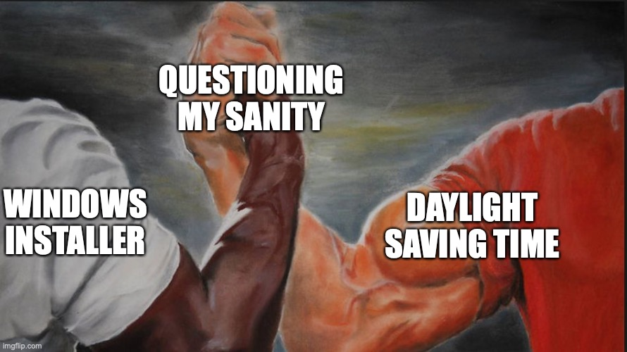

Last week I got an interesting bug report from a colleague. They were minding their own business and playing with Unreal Engine 5 when suddenly a wild build error appeared and said that some precompiled headers are out of date:

```bash
fatal error: file 'D:\toolchain\sysroot\usr\include\x86_64-linux-gnu\bits\wordsize.h' has been
modified since the precompiled header 'UE5\Engine\...\SharedPCH.CoreUObject.ShadowErrors.h.gch'
was built: mtime changed
```

Hmm, well, it looks like some source files have changed and a simple re-build would fix the issue. However, building Unreal Engine from scratch takes **considerable** time, so you can understand why we'd like to avoid that.

The toolchain and the sysroot are distributed via the SDK™ and the colleague claimed that the error happened after they've installed a new version of the SDK. I was fairly sure that the above mentioned headers files didn't actually change -- it's a toolchain sysroot, it hasn't been touched in years. Indeed, a simple `stat` shows that the modification time goes back to 2018:

```powershell
> stat "D:\toolchain\sysroot\usr\include\x86_64-linux-gnu\bits\wordsize.h"
  File: D:\toolchain\sysroot\usr\include\x86_64-linux-gnu\bits\wordsize.h
  Size: 327             Blocks: 1          IO Block: 65536  regular file
Device: eab6ee59h/3937857113d   Inode: 8162774325601647  Links: 1
Access: (0644/-rw-r--r--)  Uid: (2249065/   werat)   Gid: (1049089/ UNKNOWN)
Access: 2021-12-02 13:58:10.281221500 +0100
Modify: 2018-01-14 10:39:44.000000000 +0100  # Note: 2018-01-14 09:39:44 UTC
Change: 2021-12-02 13:58:10.281221500 +0100
 Birth: 2018-01-14 10:39:44.000000000 +0100
```

But surprisingly right after I installed the new SDK, I was getting the same build error too. Oh boy, this is going to be interesting. Down to the rabbit hole!

<!-- I don't know another way to set the max width  -->


---

The error we're seeing when building Unreal is coming from `clang` -- the compiler complains that some of the input files of the precompiled header have been modified (i.e. their `mtime` is different from what is stored in the PCH). Let's peek inside the the PCH and see whether they are actually different:

```powershell
# Dump the contents of the PCH (https://clang.llvm.org/docs/PCHInternals.html#ast-file-contents)
llvm-bcanalyzer.exe "UE5\Engine\...\SharedPCH.CoreUObject.ShadowErrors.h.gch" --dump | less
...
<INPUT_FILE abbrevid=4 op0=472 op1=327 op2=1515919184 op3=0 op4=0 op5=0/> blob data = 'D:\toolchain\sysroot\usr\include\x86_64-linux-gnu\bits\wordsize.h'
```

It's size is `327` bytes (op1), and modification time is `1515919184` (op2), which corresponds to `2018-01-14 08:39:44 UTC`:

```python
>> from datetime import datetime, timezone
>> datetime.fromtimestamp(1515919184, tz=timezone.utc)
datetime.datetime(2018, 1, 14, 8, 39, 44, tzinfo=datetime.timezone.utc)
```

To summarize what we know so far:

* **wordsize.h (from PCH)**
  * size -- 327 bytes
  * mtime -- 1515919184 (`2018-01-14 08:39:44 +0000`)
* **wordsize.h (on disk)**
  * size -- 327 bytes
  * mtime -- 1515922784 (`2018-01-14 09:39:44 +0000`)

The file size matches as well as the contents, I've checked separately. The source files used to build the precompiled header appear to be exactly the same, no _real_ modifications has been made to them. However the `mtime` is indeed different (the compiler didn't lie).

Well, I did install a newer version of the SDK recently. The sysroot headers obviously didn't change -- we can see they're are the same. Maybe the `mtime` got messed up in the newer SDK? Nope, I've tried installing several different versions, but `mtime` of that file was always the same.

It's curious though that the timestamps are different by exactly one hour. When two timestamps are different by exactly N hours programmers usually get real suspicious...


---

The SDK is distributed via the Windows Installer (MSI). And it turns out, Windows Installer adjusts the modification time of the files according to the local timezone of the target machine! It means that the actual file `mtime` will be different on different machines depending on their timezone, for example:

* Build server has UTC+0, the `mtime` of `wordsize.h` is `2018-01-14 10:00:00`.
* Developer machine has UTC+1, the `mtime` of `wordsize.h` is `2018-01-14 09:00:00` (!!).

Windows Explorer and other tools (e.g. `stat`) always display the local time, so both build server and the developer machine with show `2018-01-14 10:00:00`, but with different offsets, of course. However Windows Explorer doesn't show offsets or timezone, so for the user will just see the same modification time on both machines.

Same files, same installer, but the `mtime` will be different depending on your local timezone:

```powershell
# Let's say we're in Berlin, UTC+1
> stat "D:\toolchain\sysroot\usr\include\x86_64-linux-gnu\bits\wordsize.h"
...
Modify: 2018-01-14 10:39:44.000000000 +0100

# Aaaand now we're in Moscow, UTC+3
> stat "D:\toolchain\sysroot\usr\include\x86_64-linux-gnu\bits\wordsize.h"
...
Modify: 2018-01-14 10:39:44.000000000 +0300
```

Typically this wouldn't cause an issue -- if local time is always the same, the timestamp will match. But wait-a-minute... what about the **Daylight Saving Time**? It changes the timezone offset and the files installed after the DST will have different `mtime` compared to the files installed before the DST.

I don't know whether it's a bug or a feature, but my guess it's unlikely to be fixed anytime soon because backwards compatibility™. And that means that twice a year our users might need to rebuild their code just because. That's why we can't have nice things ¯\\\_(ツ)\_/¯

<!-- I don't know another way to set the max width  -->


Unfortunately I haven't found a good way to alter this behaviour. [Other people ran into this problem as well](https://www.advancedinstaller.com/forums/viewtopic.php?t=45880), but no solutions have been posted. It's certanly possible to add a custom step to the installer to walk over the files and "correct" their `mtime`, but who knows what else might break because of this. If you know a better way, please, send help!
