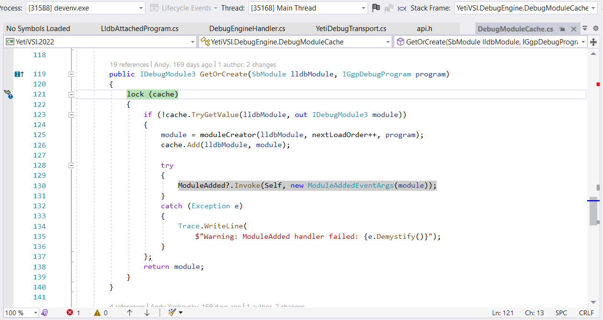
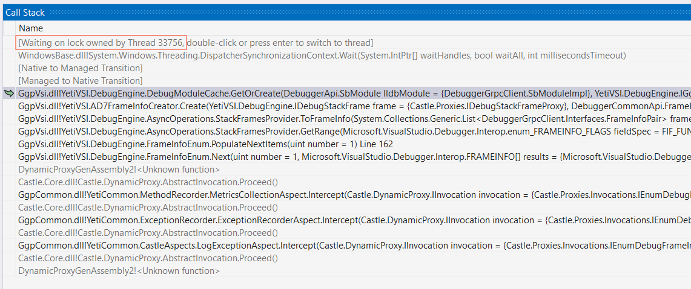
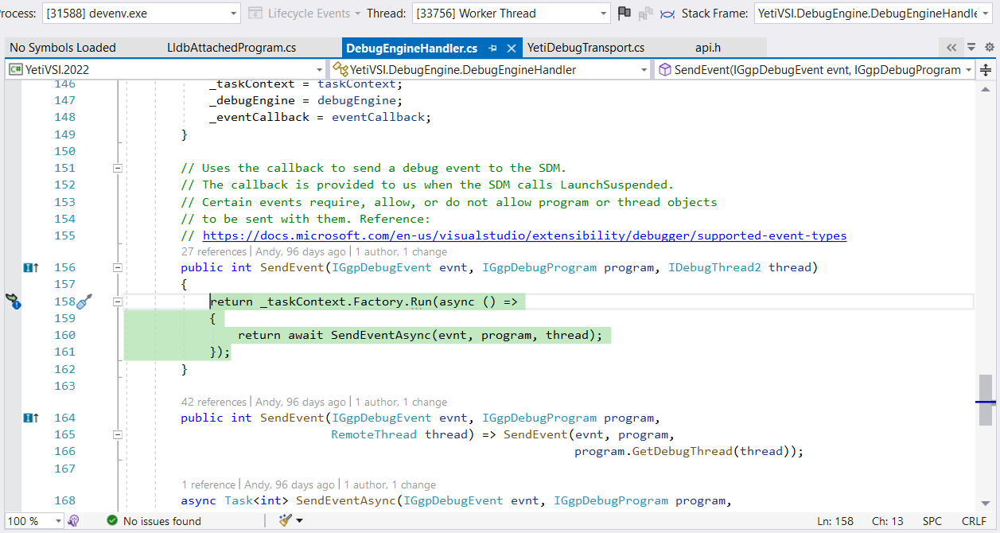
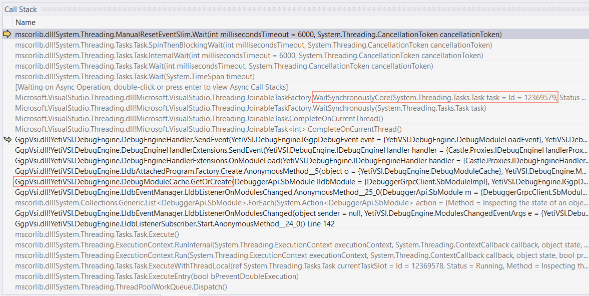
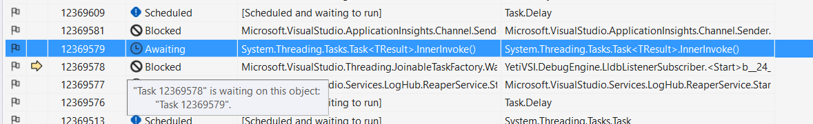
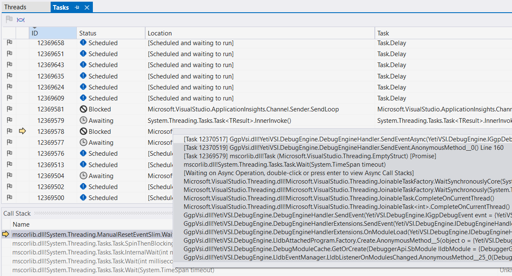
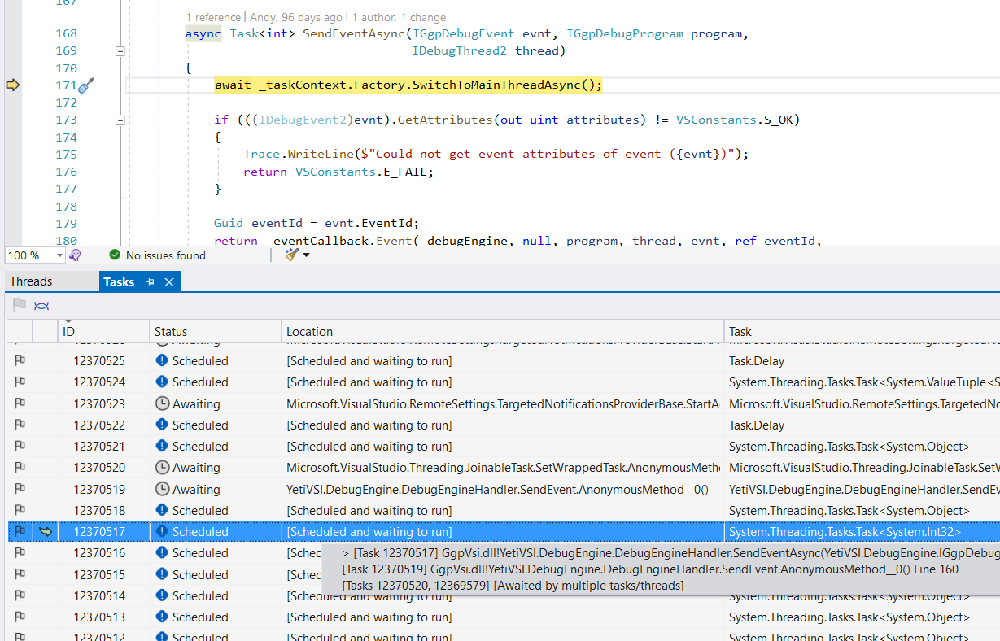

There has been lots of discussions recently about the usefulness of debuggers (on Twitter/Reddit and probably other platforms). Some people brag about never using/needing one and some people can't imagine their life without stepping through the code line by line. I'm both of these people at different times, so I'm not going to judge anyone. Instead, let me share a short debugging story and you can decide for yourself :)

---

Late afternoon, it's raining outside. Visual Studio UI is frozen and doesn't respond to anything. Windows is suggesting to give up and send the diagnostics to Microsoft. The only way out seems to be killing the application and starting all over again. But before doing that, let's try to figure out what exactly went wrong on this nice day.

Despite people complaining about Visual Studio being slow and bloaty, it doesn't really freeze that often on its own<sup>[citation needed]</sup>. It's a lot more likely that one of the extensions is misbehaving. Given that in my case Visual Studio froze in the middle of the debug session, I'm fairly confident I've been betrayed by my own extension [Stadia for Visual Studio](https://github.com/googlestadia/vsi-lldb).

Let's spin up another Visual Studio, attach the debugger to the frozen one and hit "Break All" (the pause button):



Well, well, well. What do we have here? The main thread (also known as the UI thread) is blocked trying to acquire a lock (highlighted in green on the screenshot). No wonder the application is not responding -- all the input processing is happening on the main thread. If it's stuck, the whole UI is stuck as well.

Visual Studio provides another hint here, which indicates a deadlock problem -- the line highlighted in gray was found in another thread's call stack. This means there's another thread which entered `GetOrCreate()` method, took the lock on `cache` and then proceeded to invoking the `ModuleAdded` event handlers. How do we figure out why the thread is blocked here? Who else is holding the lock? Easy! Let's take a look at the call stack:



The call stack immediately tells us that the current thread is waiting for a lock, which is already acquired by another thread -- thread `33756` in this case. Since the whole application is currently stopped, we can just switch to that thread and see what is happening there:



Okay, this thread is synchronously waiting for an asynchronous task. Let's take a look at its call stack:



First thing we see here is that indeed this thread went through the `GetOrCreate` method. It took the lock on `cache` and never released it, that's why the main thread is stuck. Now we need to figure out why this worker thread is stuck. The call stack conveniently shows us that we're waiting for another `Task` to complete - task `12369579`.

Visual Studio provides an easy way to see which tasks are currently being executed and how they depend on each other -- the Tasks Window. Let's switch there and see what it looks like for the current thread:



This confirms what we saw in the call stack -- current thread (which corresponds to task `12369578`) is waiting for task `12369579` to complete. The hover popup from the `Location` column gives even more information:



These are all the tasks in the waiting chain: `12369578` waits for `12369579`, which waits for `12370519`, which waits for `12370517`. Let's switch the the last one, task `12370517`:



Booyah! The task is trying to switch the main thread (i.e. to continue executing on the **main** thread instead of some random worker thread), which is typically done when you need to access some UI elements or, in this case, call  certain Visual Studio APIs. But the main thread is blocked! Here's a summary in terms of call sequences:

```csharp
// Main Thread
DebugAsyncStackFrame.GetInfo
↪️ AD7FrameInfoCreator.Create
  ↪️ DebugModuleCache.GetOrCreate
    ↪️ lock(cache) -- waiting

// Worker Thread
LldbEventManager.LldbListenerOnModulesChanged
↪️ DebugModuleCache.GetOrCreate
  ↪️ lock(cache) -- acquired
    ↪️ ModuleAdded.Invoke
      ↪️ DebugEngineHandler.SendEventAsync
        ↪️ await _taskContext.Factory.SwitchToMainThreadAsync()
           ↖️
            // Deadlock, main thread is waiting for lock(cache)
```

Fixing deadlocks can be tricky and it always depends on the logic of your application. Here's the solution I've implemented for this one -- [e66a6b5e](https://github.com/googlestadia/vsi-lldb/commit/e66a6b5e7df879b82e535884bad3ae148b33d68c). The "obvious" thing to do is typically move some operations outside of the critical section, but it's always worth looking deeper -- do I even need this lock? do I have to switch to main thread to perform some operation? Taking a holistic overview often leads to better design improvements.

---

Discuss this article on [lobste.rs](https://lobste.rs/s/qtdvpn/how_debug_deadlocks_visual_studio)

---
