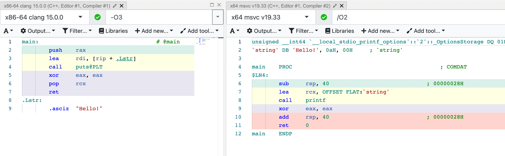

**Wine** is a compatibility layer capable of running Windows applications on several POSIX-compliant operating systems, such as Linux, macOS, & BSD (<https://www.winehq.org>).

If you have been using Linux for some time now, chances are you’ve used Wine at some point. Maybe to run that one very important Windows program that doesn’t have a Linux version or maybe to play World of Warcraft or some other game. Fun fact, Valve's [Steam Deck](https://www.steamdeck.com/) uses a Wine-based solution to run games (called [Proton](https://github.com/ValveSoftware/Proton/)).

In the last year I’ve spent quite some time working on a debugger capable of debugging both the Wine layer and the Windows application running with it. It was very interesting to learn about the Wine internals -- I’ve used Wine many times before, but never knew how it worked. If you ever wondered how it’s possible to take a Windows executable and just run it on Linux without any modifications – welcome to this article!

## Disclaimer


This article greatly simplifies reality and I don't claim to know all the details. However I hope the explanation here will give you a general understanding of how things like Wine work.

## Not an Emulator

Before describing how Wine works, let's explore how it doesn't work. Wine is a recursive acronym and it stands for “Wine Is Not an Emulator”. Why isn’t it? There are lots of great emulators, both for older architecture and for modern consoles. Could Wine be implemented as an emulator? Yep, but there are good reasons not to do this. Let's take a quick look at how emulators work in general.

Imagine we have some simple hardware, with two instructions:

* `push <value>` – pushes given `value` to the stack
* `setpxl` – pops three values from the stack and draws a pixel with color `arg1` at `(arg2, arg3)`

(this should be enough to create some cool demoscenes, right?)

```text
> dump-instructions game.rom
...
# draw red dot at (10,10)
push 10
push 10
push 0xFF0000
setpxl
# draw green dot at (15,15)
push 15
push 15
push 0x00FF00
setpxl
```

The game binary (or ROM cartridge) is a sequence of these instructions, which the hardware can load into the memory and then execute. The _real_ hardware can execute them _natively_, but what if we want to play the game on our modern laptop? We'll create a software emulator – a program that loads the ROM in memory and then executes its instructions. An interpreter or a virtual machine, if you will. The implementation of the emulator for our two-instructions console can be pretty simple:

```rust
enum Opcode {
    Push(i32),
    SetPixel,
};

let program: Vec<Opcode> = read_program("game.rom");
let mut window = create_new_window(160, 144); // Virtual screen of 160x144 pixels
let mut stack = Vec::new(); // Stack for passing arguments

for opcode in program {
    match opcode {
        Opcode::Push(value) => {
            stack.push(value);
        }
        Opcode::SetPixel => {
            let color = stack.pop();
            let x = stack.pop();
            let y = stack.pop();
            window.set_pixel(x, y, color);
        }
    }
}
```

The real emulators are a lot more complicated, but the basic idea is the same: maintain some context (memory, registers, etc), handle input (e.g. keyboard/mouse) and output (e.g. drawing to some window), parse input data (ROM) and execute the instructions one by one, applying their side-effects.

This could be one way to implement Wine, but there are two reasons against it. First, the emulators are "slow" – there's a significant overhead on executing every single instruction programmatically. This may be acceptable for older hardware, but not so much for the state of the art (and video games have always been one of the most demanding types of applications). The second reason is that there's no need! Linux/macOS are perfectly capable of running Windows binaries _natively_, they just need a little push...

Let's compile a simple program for both Linux and Windows and compare the results:

```c++
int foo(int x) {
    return x * x;
}

int main(int argc) {
    int code = foo(argc);
    return code;
}
```


(left – Linux, right – Windows)

The results are visibly different, but the instruction set is actually the same: `push`, `pop`, `mov`, `add`, `sub`, `imul`, `ret`. So if we had an "emulator" that can execute these instructions, theoretically it should be able to execute both. And turns out that we do have it – that's our CPU.

## How Linux runs a binary

Before running a Windows binary on Linux, let’s figure out how to run a normal Linux binary.

```bash
❯ cat app.cc
#include <stdio.h>

int main() {
  printf("Hello!\n");
  return 0;
}

❯ clang app.cc -o app

❯ ./app
Hello!  # works!
```

Simple enough, let’s go a bit deeper. What happens when we do `./app`?

```bash
❯ ldd app
        linux-vdso.so.1 (0x00007ffddc586000)
        libc.so.6 => /lib/x86_64-linux-gnu/libc.so.6 (0x00007f743fcdc000)
        /lib64/ld-linux-x86-64.so.2 (0x00007f743fed3000)

❯ readelf -l app

Elf file type is DYN (Position-Independent Executable file)
Entry point 0x1050
There are 13 program headers, starting at offset 64

Program Headers:
  Type           Offset             VirtAddr           PhysAddr
                 FileSiz            MemSiz              Flags  Align
  PHDR           0x0000000000000040 0x0000000000000040 0x0000000000000040
                 0x00000000000002d8 0x00000000000002d8  R      0x8
  INTERP         0x0000000000000318 0x0000000000000318 0x0000000000000318
                 0x000000000000001c 0x000000000000001c  R      0x1
      [Requesting program interpreter: /lib64/ld-linux-x86-64.so.2]
...
```

First of all, we see that the `app` is a dynamic executable. This means that it depends on some dynamic libraries and requires them to be present in runtime to be able to run. Another interesting thing here is the "requesting program interpreter" part. What's an interpreter doing here? I thought C++ was a compiled language, unlike Python...

In this context the interpreter is the "dynamic loader". It's a special program that bootstraps the execution of the original program: it resolves and loads its dependencies and then gives over the control.

```bash
❯ ./app
Hello!  # This works!

❯ /lib64/ld-linux-x86-64.so.2 ./app
Hello!  # This works too!

# Homework exercise, run this and try to make sense of the output.
❯ LD_DEBUG=all /lib64/ld-linux-x86-64.so.2 ./app
```

When running the executable, the Linux kernel detects that it's dynamic and requires a loader. Then it executes the loader, which does all the work. We can verify that by running the program under the debugger, for example:

```bash
❯ lldb ./app
(lldb) target create "./app"
Current executable set to '/home/werat/src/cpp/app' (x86_64).
(lldb) process launch --stop-at-entry
Process 351228 stopped
* thread #1, name = 'app', stop reason = signal SIGSTOP
    frame #0: 0x00007ffff7fcd050 ld-2.33.so`_start
ld-2.33.so`_start:
    0x7ffff7fcd050 <+0>: movq   %rsp, %rdi
    0x7ffff7fcd053 <+3>: callq  0x7ffff7fcdd70            ; _dl_start at rtld.c:503:1

ld-2.33.so`_dl_start_user:
    0x7ffff7fcd058 <+0>: movq   %rax, %r12
    0x7ffff7fcd05b <+3>: movl   0x2ec57(%rip), %eax       ; _dl_skip_args
Process 351228 launched: '/home/werat/src/cpp/app' (x86_64)
```

Here we can see that the first instruction executed is in `ld-2.33.so`, _not_ the `app` binary.

To summarize, the process of running a dynamically linked executable on Linux looks roughly like this:

* Kernel loads the image (≈ binary) and sees it's a dynamic executable
* Kernel loads the dynamic loader (`ld.so`) and gives it control
* The dynamic loader resolves the dependencies and loads them
* The dynamic loader gives the control back to the original binary
* The original binary starts execution in `_start()` and eventually gets to `main()`

At this point it's pretty clear why simply running a Windows executable won't work – it has different format and the kernel simply doesn't know what to do with it:

```bash
❯ ./HalfLife4.exe
-bash: HalfLife4.exe: cannot execute binary file: Exec format error
```

However, if we could get past the steps 1-4 and somehow get to 5, it should work in theory, right? Since we're talking about "execution", what does it mean, from the OS perspective, to "run" the binary?

Every executable has the `.text` section, which contains the serialized CPU instructions:

```bash
❯ objdump -drS app

app:     file format elf64-x86-64

...

Disassembly of section .text:

0000000000001050 <_start>:
    1050:       31 ed                   xor    %ebp,%ebp
    1052:       49 89 d1                mov    %rdx,%r9
    1055:       5e                      pop    %rsi
    1056:       48 89 e2                mov    %rsp,%rdx
    1059:       48 83 e4 f0             and    $0xfffffffffffffff0,%rsp
    105d:       50                      push   %rax
    105e:       54                      push   %rsp
    105f:       4c 8d 05 6a 01 00 00    lea    0x16a(%rip),%r8        # 11d0 <__libc_csu_fini>
    1066:       48 8d 0d 03 01 00 00    lea    0x103(%rip),%rcx        # 1170 <__libc_csu_init>
    106d:       48 8d 3d cc 00 00 00    lea    0xcc(%rip),%rdi        # 1140 <main>
    1074:       ff 15 4e 2f 00 00       call   *0x2f4e(%rip)        # 3fc8 <__libc_start_main@GLIBC_2.2.5>
    107a:       f4                      hlt
    107b:       0f 1f 44 00 00          nopl   0x0(%rax,%rax,1)
...
```

In order to "run" the executable the operating system loads the binary into memory (specifically the `.text` section), sets the current instruction pointer to an address where the code is located and that's it, the executable is running. Can we do the same for Windows executables?

Yes! The code inside the executables is "portable" between Windows and Linux (assuming the same CPU architecture). If we just take the code out of the Windows executable, load it in memory and point `%rip` to the right place – the processor will happily execute it!


## Hello, Wine!

Essentially, `wine` is a "dynamic loader" for Windows executables. It's a native Linux binary, hence it can just run normally, and it knows how to deal with EXE and DLLs. It's kinda an equivalent of `ld-linux-x86-64.so.2`:

```bash
# running an ELF binary
❯ /lib64/ld-linux-x86-64.so.2 ./app

# running a PE binary
❯ wine64 HalfLife4.exe
```

`wine` loads the Windows executable into memory, parses it, figures out the dependencies, figures out where the executable code is (i.e. the `.text` section) and then finally jumps into that code.

> Well, in reality it jumps into something like `ntdll.dll!RtlUserThreadStart()`, which is the "user-space" entry point in the Windows world. It will eventually get to `mainCRTStartup()` (the equivalent of `_start`) and then finally to the actual `main()`.

At this point our Linux system is executing the code originally compiled for Windows and everything seems to work. Except...

## System calls

System calls, or syscalls for short, is what makes Wine so complicated. **Syscall** is a call of a function that is implemented in the operating system (hence, _system_ call), not in the application binary or any of its dynamic libraries. The set of syscalls provided by the OS is essentially the operating system API.

Examples on Linux: `read`, `write`, `open`, `brk`, `getpid`

Examples on Windows: `NtReadFile`, `NtCreateProcess`, [`NtCreateMutant`](http://undocumented.ntinternals.net/index.html?page=UserMode%2FUndocumented%20Functions%2FNT%20Objects%2FMutant%2FNtCreateMutant.html) 😱

System calls are not regular function calls in the code. Opening a file, for example, must be performed by the kernel itself, since it's the one keeping track of the file descriptors. Therefore the application code needs a way to "interrupt" itself and give control to the kernel (this operation is typically called [context switch](https://en.wikipedia.org/wiki/Context_switch)).

The set of functions exposed by the operating system and the way they should be called are different on every operating system. On Linux, for example, in order to call `read()` the binary would put the file descriptor into the register `%rdi`, the buffer pointer to `%rsi` and the number of bytes to read to `%rdx`. On Windows, however, there's no `read()` function in the kernel! Neither the arguments would make any sense. Therefore the binary compiled for Windows will use the Windows-way of doing syscalls, which will not work on Linux as is. I won't go deep into how exactly syscalls work, here's a great article about the Linux implementation – <https://blog.packagecloud.io/the-definitive-guide-to-linux-system-calls/>.

Let's compile another small program and compare the generated code on Linux and Windows:

```c++
#include <stdio.h>

int main() {
    printf("Hello!\n");
    return 0;
}
```


(left – Linux, right – Windows)

This time we're calling a function from the standard library, which, in turn, eventually performs a system call. On the screenshot above the Linux version calls `puts` and the Windows one – `printf`. These functions are coming from the standard library (`libc.so` on Linux, `ucrtbase.dll` on Windows), which the application uses to simplify the communication with the kernel. On Linux it's fairly common these days to build statically linked binaries, which don't depend on any dynamic libraries. In that case, the implementation of `puts` is embedded into the binary and no `libc.so` is involved in runtime.

On Windows, at least until not so long ago, "only malware used direct system calls"<sup>[citation needed]</sup>. Normal applications always depend on `kernel32.dll/kernelbase.dll/ntdll.dll`, which hide the low level magic of communicating with the kernel. The application just calls a function and the libraries take care of the rest:


(credit <https://alice.climent-pommeret.red/posts/a-syscall-journey-in-the-windows-kernel/>)

At this point you probably already have a feeling of what we're going to do next 😏

## Runtime translation of syscalls

What if we could "intercept" a syscall? Like, whenever the application calls `NtWriteFile()`, we would get in between, call `write()` instead and return the result in a format the binary expects. That should work. The quick and dirty solution for the example above might look something like this:

```asm
// HelloWorld.exe
lea     rcx, OFFSET FLAT:`string'
call    printf
  ↓↓
// "Fake" ucrtbase.dll
mov edi, rcx   // Convert the arguments to Linux ABI
call puts@PLT  // Call the real Linux implementation
  ↓↓
// Real libc.so
mov rdi, <stdout>  // write to STDOUT
mov rsi, edi       // pointer to "Hello"
mov rdx, 5         // how many chars to write
syscall
```

We can provide a custom version of `ucrtbase.dll` which would have a special implementation of `printf`. Instead of trying to call the Windows kernel, it would follow the Linux ABI and call the `write` function from `libc.so`. In practice, however, the application can link against `ucrtbase.dll` statically and we can't modify the code of the binary for a number of reasons – it's messy and complicated, it messes with the DRM, etc.

So instead we would modify the place that stands in between the binary and the kernel – `ntdll.dll`. This is the "gateway" into the kernel and Wine indeed provides its [custom implementation](https://github.com/wine-mirror/wine/tree/3602c676dadf823a4868b0b72f326159cb93766e/dlls/ntdll). In the recent versions of Wine it consists of two parts: `ntdll.dll` (which is a PE library) and `ntdll.so` (which is an ELF library). The first one is a thin layer that just redirects the calls into the ELF counterpart. The ELF counterpart contains a special function called `__wine_syscall_dispatcher`, which [performs a magic trick](https://github.com/wine-mirror/wine/blob/1d178982ae5a73b18f367026c8689b56789c39fd/dlls/ntdll/unix/signal_x86_64.c#L3142) of converting the current stack from Windows to Linux and back.

Therefore, when doing a syscall the call stack of the process running with Wine looks like this:

<!-- I don't know why 697px gives the best results, but with other values the image looks blurry -->


The syscall dispatcher is a bridge between the Windows world and the Linux world. It takes care of the calling conventions -- allocates some stack space, moves the registers around, etc. Once the execution is in the Linux library (`ntdll.so`), we're free to use any regular Linux APIs (e.g. libc or syscall) and can actually read/write files, lock/unlock mutexes and so on.

## Is that it?

It sounds almost _too easy_. And it would be. First of all, there are a LOT of Windows APIs. And they're poorly documented and have known (and unknown haha) bugs, which must be preserved exactly as is. Most of the Wine source code is the implementation of various Windows DLLs.

Second, there are different ways to perform syscalls. Technically nothing prevents the application to do a direct system call via the `syscall` instruction and ideally this should work too (remember, Windows games do all kinds of crazy things). Linux kernel has a [special mechanism](https://lwn.net/Articles/824380/) to handle this and of course it only adds complexity.

Third, there's this whole 32-bit vs 64-bit nonsense. There are a lot of old 32-bit games, which are never going to be re-released as 64-bit. Wine has support for both and again, this adds up to the overall complexity of the system.

Fourth, I didn’t even mention `wine-server` – a separate process spawned by Wine, which maintains the kernel “state” (open file descriptors, mutexes, etc).

Fifth, oh, did you want to run a game? Not just a hello world? Then you need to deal with DirectX, audio (hello PulseAudio, my old friend), input devices (gamepads, joysticks), etc. It’s a lot of work!

Wine has been in development for many years and came a long way. Today you can run the latest games like Cyberpunk 2077 or Elden Ring without any issues. Damn, sometimes Wine has even better performance compared to Windows! What a time to be alive...

---

I hope this article gave you a basic idea of how Wine works. As I warned in the disclaimer, I’ve simplified a bunch of things and I may be wrong about some details (hopefully not too much). If you see that I'm outright misleading people, please reach out and correct me!

---

Discuss this article on [lobste.rs](https://lobste.rs/s/7f8exp/how_wine_works_101) or [HackerNews](https://news.ycombinator.com/item?id=33156727) or Reddit ([r/Linux_Gaming](https://www.reddit.com/r/linux_gaming/comments/y0ts39/how_wine_works_101/), [r/programming](https://www.reddit.com/r/programming/comments/y0tbuf/how_wine_works_101/))

Unofficial translations:

* Russian -- <https://habr.com/ru/company/dcmiran/blog/693842/>
* Chinese -- <https://www.freebuf.com/articles/system/346955.html>

---
