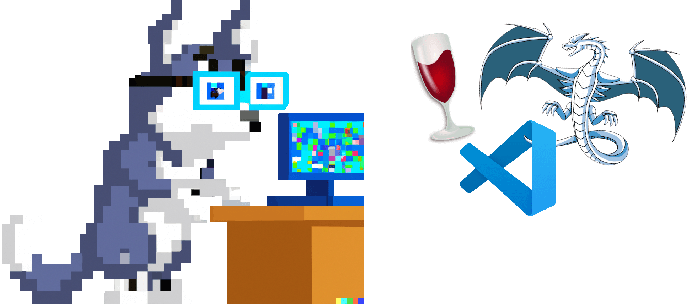
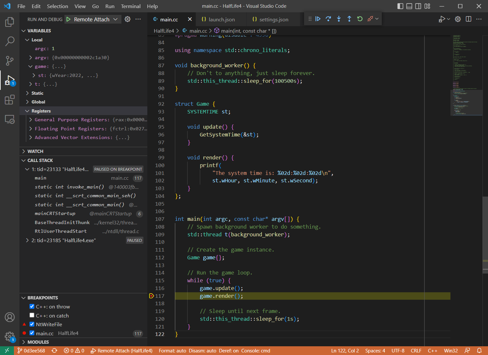
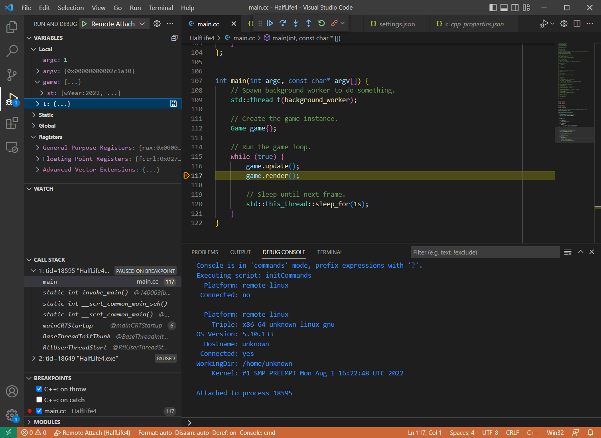
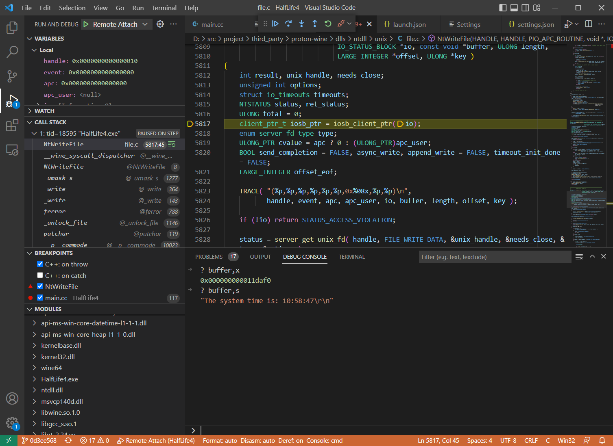

In my [previous post about Wine](/blog/how-wine-works-101/) I mentioned working on a debugger that is capable of debugging both the Wine layer and the Windows application running with it. Time to share some details!

---

Debugging Wine applications is tricky and there are different ways to do it. In many cases you don't have access to the application source code and/or debug symbols and Wine itself is often built with aggressive optimizations. The mixture of Windows and Linux modules makes most debuggers sad and people often resort to [printf-debugging](https://www.codeweavers.com/blog/aeikum/2019/1/15/working-on-wine-part-4-debugging-wine). The official [Wine Developer's Guide](https://wiki.winehq.org/Wine_Developer%27s_Guide) has some [Debugging Hints](https://wiki.winehq.org/Debugging_Hints) and a whole chapter about [Debugging Wine](https://wiki.winehq.org/Wine_Developer%27s_Guide/Debugging_Wine). It has useful links and examples of using [winedbg](https://gitlab.winehq.org/wine/wine/-/tree/master/programs/winedbg) -- a debugger written specifically for Wine. It came a long way and supports lots of features now, but still has limitations.

In this article I will demonstrate how to use [LLDB](https://lldb.llvm.org/) to debug an application running with Wine. We'll step through both the application code (i.e. Windows executable) and the Wine layer (which is mixture of Linux and Windows libraries), set some breakpoints and look at variables and memory. I'm going to use a local Windows machine to run the debugger and a remote Linux machine to run the Wine application. The debugger can work on Linux and macOS too, but Windows has better PDB support -- see more below in the section about building LLDB. Also, my workflow involves rebuilding the original executable from source, which needs to happen on Windows.

## Demo time!

Here's a quick demo of running a command-line LLDB on Windows. It demonstrates connecting to a remote Linux machine, attaching to a Wine process and doing typical debugging things: looking at the call stack, setting breakpoints and stepping, looking at variables and reading memory.

[](https://asciinema.org/a/J95lTmBX9FcHtiRREP2wxZUhu)

While I still have your attention, here's a teaser demo of using the same debugger with Visual Studio Code. Here I'm using my local Windows machine to debug a native Windows binary running on a remote Linux machine via Wine, isn't that magic? I can step through the code, set breakpoints and look at the variables as if it were a normal local process.



## Why can't it just work?

_Normally_ the main executable and its dynamic libraries all have the same formats of object files (e.g. ELF on Linux) and debug info (e.g. PDB on Windows). The debuggers also often make certain assumptions about how the dynamic loader works (remember `ld.so`?), since there's usually just one. However, certain applications are special and don't fit into this perfect picture...

An application running with Wine has two different dynamic loaders and a mixture of ELF/PE modules and DWARF/PDB debug information. Here's a quick overview of the dependencies involved when a Windows binary is executed on a Linux system via Wine, e.g. `wine HalfLife4.exe`:

* `wine` is a native Linux executable (ELF+DWARF), which is bootstrapped via the `ld.so` dynamic loader
* `wine` is a dynamic loader itself, which loads the native Windows executable `HalfLife4.exe` (PE+PDB)
* `HalfLife4.exe` may depend on some native Windows libraries, e.g. `GameEngine.dll` (PE+PDB)
* `HalfLife4.exe` also depends on certain Windows DLLs, e.g. `ntdll.dll`
* `ntdll.dll` is provided by Wine as a dll/so pair: `ntdll.dll` (PE+DWARF) + `ntdll.so` (ELF+DWARF)

As you can see, the application has a crazy mix of different formats and the debugger needs to handle all these combinations in order to correctly unwind the stack, resolve symbols, set breakpoints and so on. Luckily, LLDB doesn't make an assumption that all modules have the same format. It can handle all possible combinations, as long the data is well-formed.

One big thing missing at the moment is the support for Wine dynamic loader. Without it LLDB cannot do much. You can still attach to the process (since it's a regular Linux process after all), but the debugger won't be able to resolve the call stack or see any of the loaded modules:

```c++
(lldb) process attach --pid 29354
Process 29354 stopped
...
(lldb) bt
* thread #1, name = 'HalfLife4.exe', stop reason = signal SIGSTOP
  * frame #0: 0x00007f1c26939603
    frame #1: 0x00007f1c265aa79a
(lldb) target module list
[  0] 129BD624-C9D6-1B63-8C99-D72D21F0AD2C-2BECC83D 0x0000000000400000 C:\Users\werat\.lldb\module_cache\remote-linux\.cache\129BD624-C9D6-1B63-8C99-D72D21F0AD2C-2BECC83D\wine64-preloader
[  1] FD79862B-DC7F-5957-F69B-38086ECC9EBC-9DD4538A 0x00007ffc1dce9000 [vdso] (0x00007ffc1dce9000)
(lldb)
```

## LLDB + Wine = <3

My teammates and I have put some effort into making LLDB work better with Wine. Some of changes we made have already been merged into upstream LLDB (especially the not-too-wine-specific ones), but others were kept internal. Recently I've published most of the relevant work -- it's available in [googlestadia/vsi-lldb](https://github.com/googlestadia/vsi-lldb/tree/master/patches/llvm-project) repository (or [werat/llvm-project-wine](https://github.com/werat/llvm-project-wine) for an easier checkout). These patches can be applied cleanly on the `release/14.x` branch and _may_ require some merging/rebasing for newer versions of llvm-project.

The most important change to LLDB is about the dynamic loader support for Wine -- [Add-DYLD-plugin-for-debugging-Wine](https://github.com/werat/llvm-project-wine/blob/main/patches/0030-lldb-Add-DYLD-plugin-for-debugging-Wine.patch) by [Jaroslav Sevcik](https://github.com/jaro-sevcik). It enables the debugger to detect and process modules loaded by Wine processes, which is the basic thing it needs to work properly. Maybe this patch will find its way into upstream eventually 😃.

### Building LLDB

First, we need to build our own version of LLDB with Wine-related patches applied. As I mentioned above, you can get the patches from [werat/llvm-project-wine](https://github.com/werat/llvm-project-wine) and they can be applied on `release/14.x` branch without any conflicts.

```bash
# Clone LLDB sources and custom patches for Wine support.
git clone https://github.com/llvm/llvm-project.git --branch release/14.x --single-branch
git clone https://github.com/werat/llvm-project-wine.git

# Apply the patches.
cd llvm-project
git apply ../llvm-project-wine/patches/*

# Build LLDB!
# This normally happens in Visual Studio Developer Command Prompt.
mkdir build_optdebug && cd build_optdebug
cmake -GNinja -DLLVM_ENABLE_PROJECTS="lldb" -DCMAKE_BUILD_TYPE=RelWithDebInfo ../llvm
ninja lldb
```

There's one caveat regarding PDB support. LLDB has two implementations of the PDB parser: `NativePDB` with no external dependencies and `PDB` which uses [DIA SDK](https://learn.microsoft.com/en-us/visualstudio/debugger/debug-interface-access/debug-interface-access-sdk?view=vs-2022) (and therefore works only on Windows). The "native" parser works on any platform, but it is still work in progress and is missing lots of features. Its primary focus is post-mortem debugging (i.e. coredumps) and it doesn't work well with real-time debugging yet. The other one is more complete and works reasonably well, but it's a bit slower and supported only on Windows.

The `PDB` parser is used by default and the debugger needs to locate `msdia140.dll`, which is typically installed with Visual Studio, e.g. `[VisualStudioFolder]\DIA SDK\bin\msdia140.dll`. Either add that to `PATH` or copy the DLL to the LLDB installation location (i.e. next to the `lldb.exe/liblldb.dll`). In order to use `NativePDB` set the environmental variable `LLDB_USE_NATIVE_PDB_READER=1` when running the debugger.

### Using LLDB in command-line mode

Now that we have a debugger, let's try attaching to a simple Windows application running with Wine. In this setup the application is running on a remote Linux machine (which can be a Linux VM running via WSL, for example).

```powershell
PS D:\> D:\src\llvm-project\build_optdebug\bin\lldb.exe
(lldb) platform select remote-linux
(lldb) platform connect connect://monkey.werat.dev:44420
(lldb) process attach --pid 15872  # PID of the Wine application
```

^ this assumes there's an `lldb-server` running on the remote host

The attaching may take some time as the debugger needs to download the binaries and resolve the symbols, process them, build up some internal state (e.g. debug information lookup indexes), resolve the breakpoints and so on. LLDB is not very efficient in downloading the binaries over network, but it does have a cache, so subsequent attaches should be much faster. The result of the `process attach` should look something like this:

```c++
Process 15872 stopped
* thread #1, name = 'HalfLife4.exe', stop reason = signal SIGSTOP
    frame #0: 0x00007f37e2585603 libc-2.24.so`__select + 51
libc-2.24.so`__select:
->  0x7f37e2585603 <+51>: movq   (%rsp), %rdi
    0x7f37e2585607 <+55>: movq   %rax, %rdx
    0x7f37e258560a <+58>: callq  0x7f37e2599560            ; ___lldb_unnamed_symbol2935
    0x7f37e258560f <+63>: movq   %rdx, %rax
  thread #2, name = 'HalfLife4.exe', stop reason = signal SIGSTOP
    frame #0: 0x00007f37e2585603 libc-2.24.so`__select + 51
libc-2.24.so`__select:
->  0x7f37e2585603 <+51>: movq   (%rsp), %rdi
    0x7f37e2585607 <+55>: movq   %rax, %rdx
    0x7f37e258560a <+58>: callq  0x7f37e2599560            ; ___lldb_unnamed_symbol2935
    0x7f37e258560f <+63>: movq   %rdx, %rax
Executable module set to "C:\Users\werat\.lldb\module_cache\remote-linux\.cache\129BD624-C9D6-1B63-8C99-D72D21F0AD2C-2BE
CC83D\wine64-preloader".
Architecture set to: x86_64-unknown-linux-gnu.
```

Here we see that the application has two active threads and both are waiting for something via the `__select()` function from the standard library. I don't have the source code for `libc-2.24.so`, so LLDB only shows the disassembly. Let's see what's happening by inspecting the call stack of the current thread:

```c++
(lldb) thread backtrace
* thread #1, name = 'HalfLife4.exe', stop reason = signal SIGSTOP
  * frame #0: 0x00007f37e2585603 libc-2.24.so`__select + 51
    frame #1: 0x00007f37e22103b2 ntdll.so`NtDelayExecution(alertable='\0', timeout=0x000000000011f888) at sync.c:1618:17
    frame #2: 0x00007f37e21f679a ntdll.so`__wine_syscall_dispatcher + 414
    frame #3: 0x000000017000cce4 ntdll.dll`NtDelayExecution + 20
    frame #4: 0x0000000180022ede msvcp140d.dll`_Thrd_sleep + 62
    frame #5: 0x0000000140002b67 HalfLife4.exe`void __cdecl std::this_thread::sleep_until<struct std::chrono::steady_clock,class std::chrono::duration<__int64,struct std::ratio<1,1000000000> > >(_Abs_time=0x000000000011fb48) at thread:200
    frame #6: 0x0000000140002aba HalfLife4.exe`void __cdecl std::this_thread::sleep_for<__int64,struct std::ratio<1,1> >(_Rel_time=0x000000000011fcc8) at thread:206
    frame #7: 0x000000014000362f HalfLife4.exe`main(argc=1, argv=0x00000000002c1a20) at main.cc:120
    frame #8: 0x0000000140003fb9 HalfLife4.exe`static int invoke_main() at exe_common.inl:78
    frame #9: 0x0000000140003ede HalfLife4.exe`static int __scrt_common_main_seh() at exe_common.inl:288
    frame #10: 0x0000000140003d9e HalfLife4.exe`static int __scrt_common_main() at exe_common.inl:330
    frame #11: 0x000000014000402e HalfLife4.exe`mainCRTStartup(__formal=0x0000000067ff0000) at exe_main.cpp:16
    frame #12: 0x000000007b636179 kernel32.dll`BaseThreadInitThunk(unknown=0, entry=(HalfLife4.exe`mainCRTStartup at exe_main.cpp:15), arg=0x0000000067ff0000) at thread.c:61:5
    frame #13: 0x0000000170074345 ntdll.dll`RtlUserThreadStart(entry=(HalfLife4.exe`mainCRTStartup at exe_main.cpp:15), arg=0x0000000067ff0000) at thread.c:265:9
```

Now we're talking! It's clear now that the application is sleeping via `std::this_thread::sleep_for()` from the C++ standard library. We can see how the execution goes through different layers:

```text
HalfLife4.exe                   -- PE/PDB
 \ msvcp140d.dll                -- PE/PDB (Wine has non-debug msvcp140.dll, which is PE/DWARF)
  \ ntdll.dll                   -- PE/DWARF
   \ __wine_syscall_dispatcher  -- technically ELF/DWARF, written in ASM with manual CFI info
    \ ntdll.so                  -- ELF/DWARF
     \ libc-2.24.so             -- ELF/DWARF
```

The application was built in debug mode, so it depends on the debug versions of the standard library -- i.e. `msvcp140d.dll` instead of `msvcp140.dll`. Wine has release versions of these DLLs, but the debug ones should be provided by the user. In this case I just copied over the original Windows DLL and it works.

---

If your call stack abruptly stops at `__wine_syscall_dispatcher` make sure your Wine is built with this patch -- <https://gitlab.winehq.org/wine/wine/-/merge_requests/1065> by [florian-kuebler](https://github.com/florian-kuebler). The syscall dispatcher function is written in pure assembly ([src](https://gitlab.winehq.org/wine/wine/-/blob/e72a16b57f66b63a16bb3d1619ac4d42632cb141/dlls/ntdll/unix/signal_x86_64.c#L3351)) and manually manipulates the registers and changes the stack layout. The compiler is not able to automatically generate the unwind information and that's why the debugger cannot reconstruct the call stack. Florian's patch adds the CFI (Call Frame Information) entries which tell the compiler how the unwind information should look like. For more info about CFI see [CFI directives in assembly files](https://www.imperialviolet.org/2017/01/18/cfi.html).

---

Let's try switching to the frame with `ntdll.so!NtDelayExecution` and see what's happening there:

```c++
(lldb) frame select 1
frame #1: 0x00007f37e22103b2 ntdll.so`NtDelayExecution(
    alertable='\0', timeout=0x000000000011f888) at sync.c:1618:17
```

At this point the debugger would normally print the source code and point to the current line. We can see that LLDB successfully loaded the debug information and it does know the correct file and line/column -- it's `sync.c:1618:17`. However it couldn't open the file, because the debug information likely contains the _original_ path, i.e. the path on the build machine. We can easily verify that:

```c++
(lldb) image lookup -vn NtDelayExecution
...
1 match found in C:\Users\werat\.lldb\module_cache\remote-linux\.cache\91CE2715-98C9-69EA-B6E5-BE8E1DA4A196-5B46395A\ntdll.so:
        Address: ntdll.so[0x000000000007f170] (ntdll.so.PT_LOAD[0]..text + 472384)
        Summary: ntdll.so`NtDelayExecution at sync.c:1570
         Module: file = "C:\Users\werat\.lldb\module_cache\remote-linux\.cache\91CE2715-98C9-69EA-B6E5-BE8E1DA4A196-5B46395A\ntdll.so", arch = "x86_64"
    CompileUnit: id = {0x0000000f}, file = "/workspace/src/project/third_party/proton-wine/dlls/ntdll/unix/sync.c", language = "c99"
       Function: id = {0x000c9aa3}, name = "NtDelayExecution", range = [0x00007f37e2210170-0x00007f37e2210417)
       FuncType: id = {0x000c9aa3}, byte-size = 0, decl = sync.c:1569, compiler_type = "NTSTATUS (BOOLEAN, const LARGE_INTEGER *) __attribute__((ms_abi))"
         Blocks: id = {0x000c9aa3}, range = [0x7f37e2210170-0x7f37e2210417)
      LineEntry: [0x00007f37e2210170-0x00007f37e22101c3): /workspace/src/project/third_party/proton-wine/dlls/ntdll/unix/sync.c:1570
         Symbol: id = {0x00000890}, range = [0x00007f37e2210170-0x00007f37e2210417), name="NtDelayExecution"
       Variable: id = {0x000c9abe}, name = "alertable", type = "BOOLEAN", location = DW_OP_breg7 RSP+123, decl = sync.c:1569
       Variable: id = {0x000c9ace}, name = "timeout", type = "const LARGE_INTEGER *", location = DW_OP_breg7 RSP+112, decl = sync.c:1569
```

Yep, CompileUnit refers to `/workspace/src/project/third_party/proton-wine/dlls/ntdll/unix/sync.c`, which definitely looks like an absolute file path on the machine where Wine was built. Luckily we can tell the debugger to "map" certain sources to a different location, so that it can find them locally. In LLDB this is done by setting the `target.source-map` property:

```powershell
(lldb) settings set target.source-map /workspace/src/project/ D:\src\project\
```

Now the debugger will look for `D:\src\project\third_party/proton-wine/dlls/ntdll/unix/sync.c`. Don't mind the mess with the slashes, it will figure it out. Let's verify:

```c++
(lldb) frame select 1
frame #1: 0x00007f37e22103b2 ntdll.so`NtDelayExecution(alertable='\0', timeout=0x000000000011f888) at sync.c:1618:17
   1615             if (diff <= 0) break;
   1616             tv.tv_sec  = diff / 1000000;
   1617             tv.tv_usec = diff % 1000000;
-> 1618             if (select( 0, NULL, NULL, NULL, &tv ) != -1) break;
   1619         }
   1620     }
   1621     return STATUS_SUCCESS;
```

Cool, isn't it? Now let's go into the Windows-side of the execution. We will set a breakpoint on `Game::update()` and then let the process stop there:

```c++
(lldb) b update
Breakpoint 1: where = HalfLife4.exe`public: void __cdecl Game::update(void) + 19 at main.cc:15732480, address = 0x00000001400034b3
(lldb) c
Process 15872 stopped
* thread #1, name = 'HalfLife4.exe', stop reason = step over
    frame #0: 0x00000001400034bf HalfLife4.exe`public: void __cdecl Game::update(this=0x000000000011fbd8) at main.cc:96
   93       SYSTEMTIME st;
   94
   95       void update() {
-> 96           GetSystemTime(&st);
   97       }
   98
   99       void render() {
```

Yay, it works! 🎉

### Using Visual Studio Code

Using command-line is nice and familiar, but the debugging tech is not standing still. Visual Studio Code is quite popular these days and it has a builtin [debugging support](https://code.visualstudio.com/Docs/editor/debugging). It integrates natively with the [Debug Adapter Protocol](https://microsoft.github.io/debug-adapter-protocol/) (DAP), which allows plugging in third-party debuggers with minimal effort.

The easiest way to use LLDB with Visual Studio Code is via the [CodeLLDB](
https://marketplace.visualstudio.com/items?itemName=vadimcn.vscode-lldb) extension. CodeLLDB comes with its own version of LLDB, but it's possible [to use custom builds](https://github.com/vadimcn/vscode-lldb/blob/fe1fb617b273d846b76ba75087e7f35232c9bd9e/MANUAL.md#alternate-lldb-backends). All you need to do is specify the path to `liblldb.dll/so` via the `lldb.library` key in the User or Workspace JSON settings:

```json
{
    "lldb.library": "D:\\src\\llvm-project-wine\\build_optdebug\\bin\\liblldb.dll"
}
```

> LLDB also has its own implementation of the debug adapter -- [lldb-vscode](https://github.com/llvm/llvm-project/tree/main/lldb/tools/lldb-vscode). However it supports fewer features and requires a couple of manual steps to set up with Visual Studio Code.

For attaching to a remote process we need a [debugger launch configuration](https://code.visualstudio.com/Docs/editor/debugging#_launchjson-attributes), also see the [Remote debugging](https://github.com/vadimcn/vscode-lldb/blob/fe1fb617b273d846b76ba75087e7f35232c9bd9e/MANUAL.md#remote-debugging) section in the CodeLLDB documentation. In my case the configuration is pretty simple -- declare the source mapping, connect to the remote machine and attach to the process:

```json
{
    "name": "Remote Attach",
    "type": "lldb",
    "request": "attach",
    "initCommands": [
        "platform select remote-linux",
        "platform connect connect://<host>:<port>",
    ],
    "pid": 12345,
    "sourceMap": {
        "/workspace/src/project/": "D:\\src\\project\\"
    }
}
```

^ this assumes there's an `lldb-server` running on the remote machine and Wine process ID is `12345`.

Now you can go to the "Run and Debug" panel and select "Remote Attach" debug configuration. Click run and wait! Upon the attach you'll see something like this:



Here's another example, demonstrating stepping through the Wine code when doing a syscall (`NtWriteFile`):



CodeLLDB supports [various variable formats](https://github.com/vadimcn/vscode-lldb/blob/master/MANUAL.md#formatting) and makes it easier to inspect the data. In the example above `buffer` is a void pointer, but you can print its value as a C-string via `buffer,s`.

## Other ways to debug Wine

As I mentioned in the beginning, using winedbg is an option. It can be run as a gdb-server, so any compatible debugger (like GDB or LLDB) can be used as a frontend. However, depending on the platform and the frontend, certain things may not work properly (e.g. PDB support).

It's possible to use GDB directly too, here's an example -- <https://trofi.github.io/posts/221-debugging-wine.html>. There is also a [GDB fork](https://github.com/JuliaComputing/gdb-solib-wine) from JuliaComputing with some Wine-related improvements. It is primarily intended for situations where winedbg cannot be used, e.g. in [rr](https://rr-project.org/) traces, but it can be used for regular real-time debugging too.

Happy 🍷 debugging!

---

Discuss this article on [lobste.rs](https://lobste.rs/s/)

---
