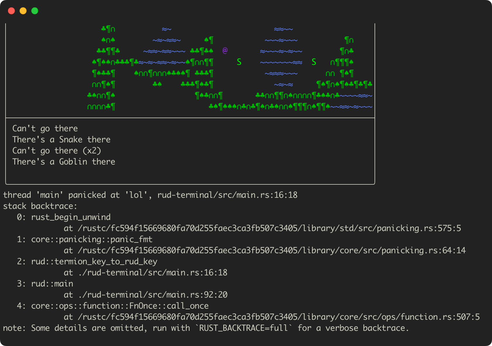

In my efforts to get better at Rust I've recently been working on a terminal-based roguelike game 🦀. One of the first things terminal-based applications (e.g. games, text editors, tools like `top`) do at startup is switch the terminal into [raw mode](https://en.wikipedia.org/wiki/Terminal_mode). This article is about a short journey of how-do-I-get-a-pretty-panic-backtrace-when-my-terminal-is-in-raw-mode.



<!--more-->

## I just want a pretty backtrace

In raw mode the terminal doesn't do any "processing" of the input (so you can handle "raw" keystrokes) and doesn't echo the pressed keys to stdout (so you get full control over the output). Switching the terminal mode is done via functions from [termios.h](https://man7.org/linux/man-pages/man3/termios.3.html) and I highly recommend reading a very comprehensive article ["Entering raw mode"](https://viewsourcecode.org/snaptoken/kilo/02.enteringRawMode.html)  about working with terminal attributes. I didn't want to do the low-level work myself, so I used a popular crate [`termion`](https://github.com/redox-os/termion) (~2k stars, ~90k "used by") to do it for me:

```rust
use std::io::{stdout, Write};
use termion::raw::IntoRawMode;

fn main() {
    let mut stdout = stdout().into_raw_mode().unwrap();

    writeln!(stdout, "Hello").unwrap();
    writeln!(stdout, "world").unwrap();
}
```

The function `into_raw_mode()` returns `RawTerminal<T>`, which is a convenience wrapper to switch the terminal back to the [cooked mode](https://en.wikipedia.org/wiki/Terminal_mode) when the program ends. `RawTerminal` implements the `Drop` trait and [restores the original terminal attributes](https://gitlab.redox-os.org/redox-os/termion/-/blob/f2b8517c3185d8a6384109c7309589aa9ad48b49/src/raw.rs#L43-47) when the object is destroyed.

```sh
> cargo run
Hello
     World!
```

Works exactly as expected. However there's a minor inconvenience here. By default whenever a Rust program panics the crash handler prints an error message (and possibly the backtrace) to the standard output. Let's see how it looks like for our program:

```rust
fn main() {
    let mut stdout = stdout().into_raw_mode().unwrap();
    ...
    panic!("Whoops");
}

> cargo run
Hello
     world
          thread 'main' panicked at 'Whoops', src/main.rs:10:5
                                                              note: run with `RUST_BACKTRACE=1` environment variable to display a backtrace
```

Whoops, the panic message is distorted. There's a problem -- the terminal is in the raw mode, but the panic handler doesn't know that. It naively prints the backtrace line by line and doesn't explicitely move the cursor to the beginning of the line after the `\n` character (because why would it?). This means that each line slides further and further making the whole output barely readable.

Conveniently `RawTerminal<T>` has a method to disable the raw mode -- `suspend_raw_mode()`. If we could call it before printing the backtrace, that would solve our problem. There's a function in the Rust standard library to override the default panic behaviour -- `std::panic::set_hook()`, so piece of cake?

```rust
fn main() {
    let mut stdout = stdout().into_raw_mode().unwrap();

    let default_panic = std::panic::take_hook();
    std::panic::set_hook(Box::new(move |info| {
        stdout.suspend_raw_mode().unwrap();
        default_panic(info);
    }));

    writeln!(stdout, "Hello").unwrap();
    writeln!(stdout, "world").unwrap();

    panic!("Whoops");
}
```

Unfortunately, this code doesn't compile:

```sh
error[E0382]: borrow of moved value: `stdout`
  --> src/main.rs:13:5
   |
5  |     let mut stdout = stdout().into_raw_mode().unwrap();
   |         ---------- move occurs because `stdout` has type `RawTerminal<Stdout>`, which does not implement the `Copy` trait
...
8  |     std::panic::set_hook(Box::new(move |info| {
   |                                   ----------- value moved into closure here
9  |         stdout.suspend_raw_mode().unwrap();
   |         ------ variable moved due to use in closure
...
13 |     writeln!(stdout, "Hello").unwrap();
   |     ^^^^^^^^^^^^^^^^^^^^^^^^^ value borrowed here after move
   |
   = note: this error originates in the macro `writeln` (in Nightly builds, run with -Z macro-backtrace for more info)
```

It makes sense, `RawTerminal<T>` is not copyable, so it has to be moved into the closure. This means the `stdout` variable is no longer valid after that and we can't use it for `writeln!()`. We need to wrap the terminal object in `Arc<Mutex<T>>`. `Arc<T>` (without mutex) won't work because it doesn't allow mutable references to underlying data. For interior mutability we use `Mutex` (instead of typical `RefCell`) because `set_hook` [requires the argument to be `Sync + Send`](https://doc.rust-lang.org/std/panic/fn.set_hook.html).

```rust
fn main() {
    let stdout = Arc::new(Mutex::new(stdout().into_raw_mode().unwrap()));

    let default_panic = std::panic::take_hook();
    let cls_stdout = Arc::clone(&stdout);
    std::panic::set_hook(Box::new(move |info| {
        let mut stdout = cls_stdout.lock().unwrap();
        stdout.suspend_raw_mode().unwrap();
        stdout.write(b"\n").unwrap();
        default_panic(info);
    }));

    writeln!(stdout.lock().unwrap(), "Hello").unwrap();
    writeln!(stdout.lock().unwrap(), "world").unwrap();

    panic!("Whoops");
}
```

Now this works great!

```sh
> cargo run
Hello
     world

thread 'main' panicked at 'Whoops', src/main.rs:19:5
note: run with `RUST_BACKTRACE=1` environment variable to display a backtrace
```

However, this solution has two significant problems. Can you spot them?

### Problem #1 -- don't panic

What happens if the program doesn't panic? It turns out the panic hook [is stored in a static variable](https://github.com/rust-lang/rust/blob/267cd1d2c5abf5f0d825822a4179ba807b69ffb4/library/std/src/panicking.rs#L96) and according to the [Rust specification](https://doc.rust-lang.org/reference/items/static-items.html), "static items do not call `drop()` at the end of the program". Consider the following example:

```rust
struct Foo {}

impl Drop for Foo {
    fn drop(&mut self) {
        println!("Dropping Foo!");
    }
}

fn main() {
    let foo = Arc::new(Mutex::new(Foo {}));

    let hook_foo = Arc::clone(&foo);
    std::panic::set_hook(Box::new(move |info| {
        let _ = &hook_foo;
    }));
}
```

This program [runs and prints nothing](https://play.rust-lang.org/?version=stable&mode=debug&edition=2021&gist=0ed2871afbdfff6cf759fe2ee064667b). The panic hook holds a reference to the `Foo` object via `Arc`, which prevents it from being dropped. In our case this means that the terminal stays in the raw mode even after the program exits:

```sh
> cargo run
Hello
     world

          > echo "one\ntwo\nthree"
one
   two
      three
```

Now this is annoying! After all _not_ panicking is normal behaviour, it should definitely work as expected.

A simple fix for this is to use a weak reference instead or a strong one. Weak references are not counted by `Arc` when deciding whether it's time to destroy the underlying object, so the panic hook won't keep the `RawTerminal` alive.

```rust
let default_panic = std::panic::take_hook();
let weak_stdout = Arc::downgrade(&stdout);
std::panic::set_hook(Box::new(move |info| {
    if let Some(arc_stdout) = weak_stdout.upgrade() {
        let mut stdout = arc_stdout.lock().unwrap() {
        stdout.suspend_raw_mode().unwrap();
        stdout.write(b"\n").unwrap();
    }
    default_panic(info);
}));
```

### Problem #2 -- all my locks are dead

What happens if the program panics while `stdout` is locked? In this case the panic hook will deadlock.

```rust
fn main() {
    let stdout = Arc::new(Mutex::new(stdout().into_raw_mode().unwrap()));

    let default_panic = std::panic::take_hook();
    let hook_stdout = Arc::clone(&stdout);
    std::panic::set_hook(Box::new(move |info| {
        // 3. This is a deadlock -- the lock on `hook_stdout` is being held in step 2
        let mut stdout = hook_stdout.lock().unwrap();
        stdout.suspend_raw_mode().unwrap();
        stdout.write(b"\n").unwrap();
        default_panic(info);
    }));

    // 1. Lock the output once as an optimization ^_^
    let mut o = stdout.lock().unwrap();
    writeln!(o, "Hello").unwrap();
    writeln!(o, "world").unwrap();

    // 2. Panic while still holding the lock on `stdout`
    panic!("Whoops");
}
```

This can be solved by using a reentrant mutex instead of a regular `Mutex`. Unfortunately Rust standard library doesn't have one (even though [stdout/stderr are using one internally](https://github.com/rust-lang/rust/blob/3fee48c161a48b0c142d3998fff56faee96bd56c/library/std/src/io/stdio.rs#L553)), so we'd have to use something like `parking_lot::ReentrantMutex` from the [`parking_lot`](https://github.com/Amanieu/parking_lot) crate.

But even though reentrant mutex solves the problem of _locking_ the underlying object multiple times, it exposes a more fundamental issue -- we're trying to have two mutable references at the same time (one at the source of the panic, another in the panic hook), which goes against Rust philosophy. That's why `parking_lot::ReentrantMutex` doesn't allow taking mutable references to the underlying object. We can wrap our terminal object in `RefCell`, but that will have the same problem as the regular mutex. If the panic happens while we're holding a mutable reference via `bottow_mut()` the panic hook will fail:

```rust
fn main() {
    let stdout = Arc::new(ReentrantMutex::new(RefCell::new(
        stdout().into_raw_mode().unwrap(),
    )));

    let default_panic = std::panic::take_hook();
    let hook_stdout = Arc::clone(&stdout);
    std::panic::set_hook(Box::new(move |info| {
        let guard = hook_stdout.lock();
        // 3. This will panic, the mutable reference already exists in step 2
        let mut stdout = guard.borrow_mut();
        stdout.suspend_raw_mode().unwrap();
        stdout.write(b"\n").unwrap();
        default_panic(info);
    }));

    let guard = stdout.lock();
    // 1. Get the mutable reference once as an optimization ^_^
    let mut o = guard.borrow_mut();
    writeln!(o, "Hello").unwrap();
    writeln!(o, "world").unwrap();

    // 2. Panic while still holding a mutable reference on `stdout`
    panic!("Whoops");
}
```

We could call `borrow_mut()` on every call, but that's no different from calling `lock()` on the Mutex ¯\\\_(ツ)\_/¯

```rust
writeln!(stdout.lock().unwrap(), "Hello").unwrap();
writeln!(stdout.lock().unwrap(), "world").unwrap();

// vs

let o = stdout.lock();
writeln!(o.borrow_mut(), "Hello").unwrap();
writeln!(o.borrow_mut(), "world").unwrap();
```

In my opinion a more practical solution is to use `Mutex::try_lock()` in the panic hook instead. If the lock is already held for whatever reason (which really should be a very rare situation and possibly a logical bug), then just give up and print an ugly backtrace:

```rust
std::panic::set_hook(Box::new(move |info| {
    if let Ok(ref mut stdout) = hook_stdout.try_lock() {
        stdout.suspend_raw_mode().unwrap();
        stdout.write(b"\n").unwrap();
    } else {
        println!("Sorry, RawTerminal is already locked, can't do anything about it :(");
    }
    default_panic(info);
}));

> cargo run
Hello
     world
          Sorry, RawTerminal is already locked, can't do anything about it :(
                                                                             thread 'main' panicked at 'Whoops', src/main.rs:28:5
                                                                                                                                 note: run with `RUST_BACKTRACE=1` environment variable to display a backtrace
```

## Recap

Here's the final solution that incorporates the fixes for both problems. It avoids the deadlock and properly returns the terminal back to the cooked mode regardless of whether the application panicked or not.

```rust
fn main() {
    let stdout = Arc::new(Mutex::new(stdout().into_raw_mode().unwrap()));

    let default_panic = std::panic::take_hook();
    let weak_stdout = Arc::downgrade(&stdout);
    std::panic::set_hook(Box::new(move |info| {
        if let Some(stdout) = weak_stdout.upgrade() {
            if let Ok(ref mut stdout) = stdout.try_lock() {
                stdout.suspend_raw_mode().unwrap();
                stdout.write(b"\n").unwrap();
            } else {
                println!("Sorry, RawTerminal is already locked, can't do anything about it :(");
            }
        }
        default_panic(info);
    }));
    ...
}
```

## Is this the best we can do?

The more I thought about it, the more I got convinced that this particular situation shouldn't have this many pitfalls. After all we don't really _need_ to have exclusive access to the `Stdout` object in order to switch it to the raw mode and back. A little bit of `unsafe` can help us out, but here's another observation -- do we even need to have an abstraction like `RawTerminal<T>`?

Would we ever have two different instances of `RawTerminal<T>` switching into the raw mode independently? Not really. Even `termion` agrees with us -- it [hardcodes `stdout` file descriptor](https://gitlab.redox-os.org/redox-os/termion/-/blob/f2b8517c3185d8a6384109c7309589aa9ad48b49/src/sys/unix/attr.rs#L8) when working with terminal attributes. Although `RawTerminal` is defined as `RawTerminal<T: Write>`, in practice it's basically `RawTerminal<Stdout>`. Given that it's essentially a singleton, a better interface might look like this:

```rust
fn enable_raw_mode();
fn disable_raw_mode();
```

Another popular crate [`crossterm`](https://github.com/crossterm-rs/crossterm) (~2k stars, ~20k "used by") provides exactly this API, so let's try it out. We still need to set the panic hook, but the whole thing is much simpler as there's no need for reference counters or locks:

```rust
use crossterm::terminal;

fn main() {
    terminal::enable_raw_mode().unwrap();

    let default_panic = std::panic::take_hook();
    std::panic::set_hook(Box::new(move |info| {
        _ = terminal::disable_raw_mode();
        println!();
        default_panic(info);
    }));

    ...

    terminal::disable_raw_mode().unwrap();
}
```

Much better! In my game I'm actually using very few things from `termion`, because native terminal is only one of two "frontends" (the other one is [`xterm.js`](https://xtermjs.org/) + WASM). Switching to `crossterm` took less time than investigating the issue and writing this article 😜 At least I hope you were entertained!

## Links

1. <https://thevaluable.dev/guide-terminal-shell-console>
2. <https://viewsourcecode.org/snaptoken/kilo/02.enteringRawMode.html>
