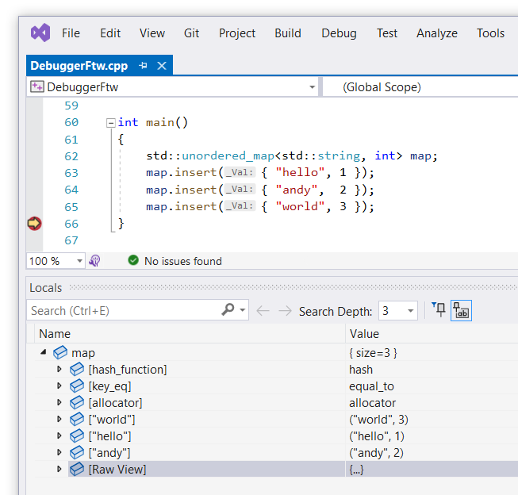
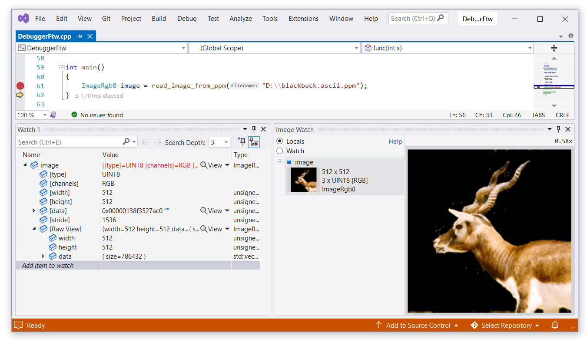
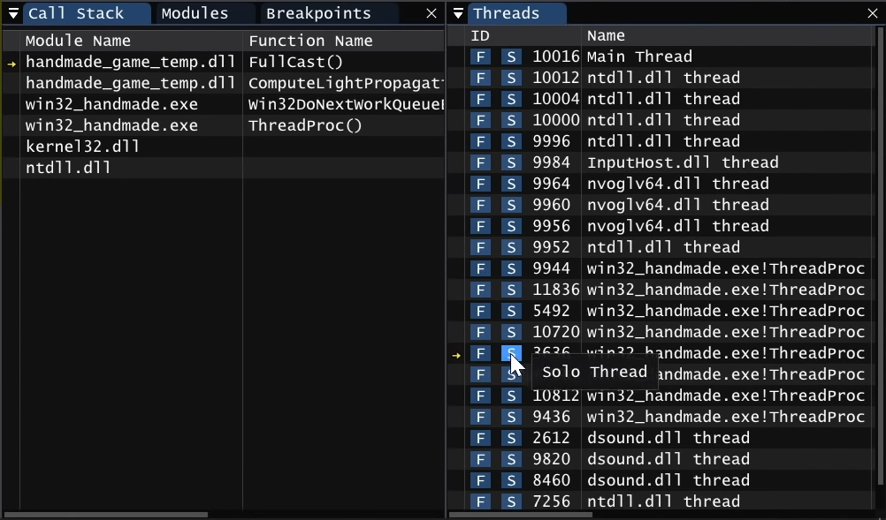
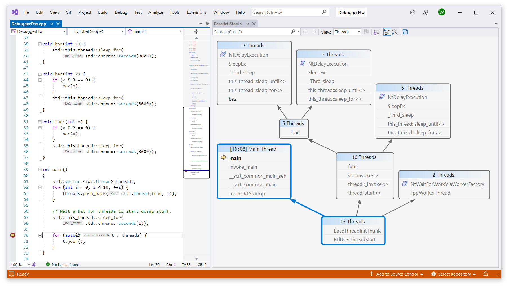
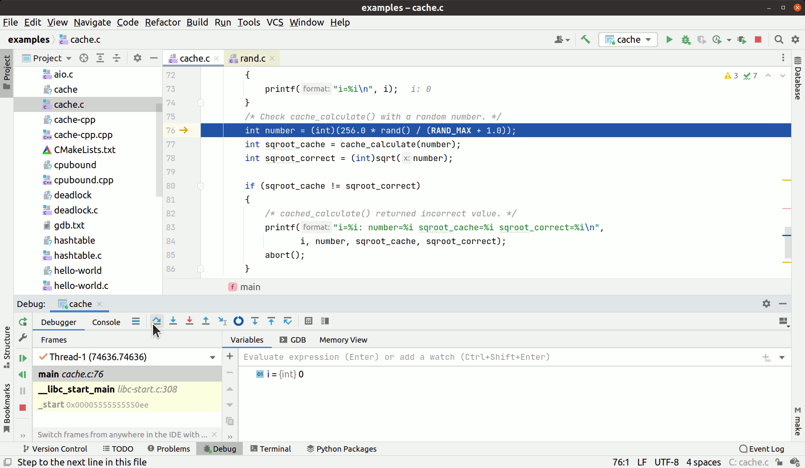

When people say "debuggers are useless and using logging and unit-tests is much better," I suspect many of them think that debuggers can only put breakpoints on certain lines, step-step-step through the code, and check variable values. Whereas any reasonable debugger can indeed do all of that, it's only the tip of the iceberg. Think about it; we could already step through the code 40 years ago, surely some things have changed?

**Tl;dr** -- in this episode of old-man-yells-at-cloud, you will learn that a good debugger supports different kinds of breakpoints, offers rich data visualization capabilities, has a REPL for executing expressions, can show the dependencies between threads and control their execution, pick up changes in the source code and apply them without restarting the program, can step through the code backward and rewind the program state to any point in history, and even record the entire program execution and visualize control flow and data flow history.

I should mention that the perfect debugger doesn't exist. Different tools support different features and have different limitations. As usual, there's no one-size-fits-all solution, but it's important to understand what's theoretically possible and what we should strive for. In this article, I will describe different debugging features and techniques and discuss the existing tools/products that offer them.

> **Disclaimer**. In this article I mention various free and commercial products as examples. I'm not being paid or incentivised in any other way by the companies behind those products (although I will not say no to free swag should they decide to send me some cough-cough). My goal is to raise awareness and challenge the popular belief that "debuggers are useless, let's just printf".

<!--more-->

## Breakpoints, oh my breakpoints

Let's start with the basics -- breakpoints. They've been with us since the dawn of time and every debugger supports them. Put a breakpoint on some line in the code and the program will stop when the execution gets to that line. As basic as it gets. But modern debuggers can do a lot more than that.

**Column breakpoints.** Did you know it's possible to put breakpoints not just on a specific line, but on a line+column as well? If a single line of source code contains multiple expressions (e.g. function calls like `foo() + bar() + baz()`), then you can put a breakpoint in the middle of the line and skip directly to that point of execution. [LLDB has supported this](https://jonasdevlieghere.com/lldb-column-breakpoints/) for a while now, but the IDE support might be lacking. Visual Studio has a command called [Step into specific](https://www.tabsoverspaces.com/233742-step-into-a-specific-call-when-debugging-in-visual-studio), which solves a similar problem -- it allows you to choose which function to step into if there are multiple calls on the same line.

**Conditional breakpoints.** Typically there's a bunch of extra options you can set on breakpoints. For example, you can specify the ["hit count" condition](https://learn.microsoft.com/en-us/visualstudio/debugger/using-breakpoints?view=vs-2022#set-a-hit-count-condition) to trigger the breakpoint only after a certain amount of times it was hit or every Nth iteration. Or use an even more powerful concept -- [conditional expressions](https://learn.microsoft.com/en-us/visualstudio/debugger/using-breakpoints?view=vs-2022#breakpoint-conditions), -- to trigger the breakpoint when your application is in a certain state. For example, you can make the breakpoint to trigger only when the hit happens on the main thread and `monster->name == "goblin"`. Visual Studio debugger also supports the "when-changes" type of conditional expressions -- trigger the breakpoint when the value of `monster->hp` changes compared to the previous time the breakpoint was hit.

**Tracing breakpoints (or tracepoints).** But what if breakpoints didn't break? 🤔 Say no more, instead of stopping the execution, [we can print a message to the output](https://devblogs.microsoft.com/visualstudio/tracepoints/). And not just a simple string literal like "got here lol"; the message can contain expressions to calculate and embed values from the program, e.g. "iteration #{i}, current monster is {monster->name}". Essentially, we're injecting printf calls to random places in our program without rebuilding and restarting it. Neat, right?

**Data breakpoints**. Breakpoints also don't have to be on a specific line, address or function. All modern debuggers support data breakpoints, which means the program can stop whenever a specific location in memory is written to. Can't figure out why the monster is randomly dying? Set a data breakpoint on the location of `monster->hp` and get notified whenever that value changes. This is especially helpful in debugging situations where some code is writing to memory that it shouldn't. Combine it with printing messages and you get a powerful logging mechanism that can't be achieved with printf!

## Data visualization

Another basic debugging feature -- data inspection. Any debuggers can show the values of variables, but good debuggers offer rich capabilities for custom visualizers. GDB has [pretty printers](https://sourceware.org/gdb/onlinedocs/gdb/Writing-a-Pretty_002dPrinter.html#Writing-a-Pretty_002dPrinter), LLDB has [data formatters](https://lldb.llvm.org/use/variable.html) and Visual Studio has [NatVis](https://learn.microsoft.com/en-us/visualstudio/debugger/create-custom-views-of-native-objects?view=vs-2022). All of these mechanisms are pretty flexible and you can do virtually anything when visualizing your objects. It's an invaluable feature for inspecting complex data structures and opaque pointers. For example, you don't need to worry about the internal representation of a hash map, you can just see the list of key/value entries.



These visualizers are extremely useful, but good debuggers can do even better. If you have a GUI, why limit yourself to "textual" visualization? The debugger can show data tables and charts (e.g. results of SQL queries), render images (e.g. icons or textures), play sounds and [so much more](https://marketplace.visualstudio.com/items?itemName=hediet.debug-visualizer). The graphical interface opens up infinite possibilities here and these visualizers are not even that hard to implement.


_↑ Visual Studio with [Image Watch](https://marketplace.visualstudio.com/items?itemName=VisualCPPTeam._ImageWatchForVisualStudio2022)_

## Expression evaluation

Most modern debuggers support expression evaluation. The idea is that you can type in an expression (typically using the language of your program) and the debugger will evaluate it using the program state as context. For example, you type `monsters[i]->get_name()` and the debugger shows you `"goblin"` (where `monsters` and `i` are variables in the current scope). Obviously this is a giant can of worms and the implementation varies a lot in different debuggers and for different languages.

For example, Visual Studio debugger for C++ implements a reasonable subset of C++ and can even perform function calls (with some limitations). It uses an interpreter-based approach, so it's pretty fast and "safe", but doesn't allow executing truly arbitrary code. Same thing [is done by GDB](https://stackoverflow.com/a/44287014). LLDB on the other hand [uses an actual compiler](https://www.youtube.com/watch?v=vuNZLlHhy0k) (Clang) to compile the expression down to the machine code and then executes it in the program (though in some situations it can use interpretation as an optimization). This allows executing virtually any valid C++!

```c++
(lldb) expr
Enter expressions, then terminate with an empty line to evaluate:
  1: struct Foo {
  2:   int foo(float x) { return static_cast<int>(x) * 2; }
  3: };
  4: Foo f;
  5: f.foo(3.14);
(int) $0 = 6
```

Expression evaluation is a very powerful feature which opens up a lot of possibilities for program analysis and experimentation. By calling functions you can explore how your program behaves in different situations and even alter its state and execution. The debuggers also often use expression evaluation to power other features, like conditional breakpoints, data watches and data formatters.

## Concurrency and multithreading

Developing and debugging multithreaded applications is hard. Many concurrency-related bugs are tricky to reproduce and it's not uncommon for the whole program to behave very differently when run under a debugger. Still, good debuggers can offer a lot of help here.

A great example of a situation where a debugger can save you a lot of time is **debugging deadlocks**. If you managed to catch your application in a state of deadlock, you're in luck! A good debugger will show the call stacks of all threads and the dependencies between them. It's very easy to see which threads are waiting for which resources (e.g. mutexes) and who's hogging those resources. A while ago I wrote an article about a case of [debugging deadlocks in Visual Studio](https://werat.dev/blog/how-to-debug-deadlocks-in-visual-studio/), see for yourself how easy it is.

A very common problem with developing and debugging multithreaded applications is that it's hard to control which threads are executed when and in which order. Many debuggers follow the "all-or-nothing" policy meaning that when a breakpoint is hit the whole program is stopped (i.e. all of its threads). If you hit "continue" all threads start running again. This works ok if the threads in your program don't overlap, but becomes really annoying when the same code is executed by different threads and the same breakpoints are being hit in random order.

A good debugger can **freeze and unfreeze threads**. You can select which threads should execute and which should sleep. This makes debugging of heavily parallelized code much-much easier and you can also emulate different race conditions and deadlocks. In Visual Studio you can [freeze and thaw threads in the UI](https://learn.microsoft.com/en-us/visualstudio/debugger/walkthrough-debugging-a-multithreaded-application?view=vs-2022#freeze-and-thaw-threads) and GDB has a thing called [non-stop mode](https://sourceware.org/gdb/onlinedocs/gdb/Non_002dStop-Mode.html). [RemedyBG](https://remedybg.itch.io/remedybg) has a very convenient UI where you can quickly switch into the "solo" mode and back ([demo](https://youtu.be/r9eQth4Q5jg?t=120), relevant part starts at 2:00).



I already mentioned this earlier, but debuggers can show the dependencies between threads. A good debugger also supports coroutines (green threads, tasks, etc) and offers some tools to visualize the current program state. For example, Visual Studio has a feature called **Parallel Stacks**. In this window you can get a quick overview of the whole program state and see which code is being executed by different threads.



## Hot reload

Imagine a typical debugging sessions. You run the program, load the data, perform some actions and finally get to point where you spot the bug. You put some breakpoints, step-step-step and suddenly realize that a certain "if" condition is wrong -- it should be `>=` instead of `>`. What do you do next? Stop the program, fix the condition, rebuild the program, run it, load the data, perform some actions... Wait-wait. It's 2023, what do you actually do next?

You fix the condition and save the file. You blink twice and the program picks up the changes in the code! It didn't restart and it didn't lose the state, it's exactly in the place where you left it. You immediately see your fix was incorrect and it should actually be `==`. Fix again and voila, the bug is squashed.

This magic-like feature is called **hot reload** -- a good debugger can pick up the changes in the source code and apply them to a live running program without restarting it. Many people who use dynamic or VM-based languages (like JavaScript or Python or Java) know it's a thing, but not everyone realizes it's possible for compiled languages like C++ or Rust too! For example, Visual Studio supports hot reloading for C++ via [Edit and Continue](https://learn.microsoft.com/en-us/visualstudio/debugger/edit-and-continue-visual-cpp?view=vs-2022). It does have a long list of [restrictions and unsupported changes](https://learn.microsoft.com/en-us/visualstudio/debugger/supported-code-changes-cpp?view=vs-2022#BKMK_Unsupported_changes), but it still works reasonably well in many common scenarios ([demo](https://www.youtube.com/watch?v=x_gr6DNrJuM)).

<!--  -->

Another awesome technology is [Live++](https://liveplusplus.tech/index.html) -- arguably, the best hot reload solution available today. It supports different compilers and build systems and can be used with any IDE or debugger. The list of [unsupported scenarios](https://liveplusplus.tech/docs/documentation.html#limitations) is much shorter and many of those are not _fundamental_ restrictions -- with enough effort, hot reload can work with almost any kind of changes.

Hot reload is not _just_ about applying the changes to a live program. A good hot reload implementation can [help to recover from fatal errors](https://liveplusplus.tech/docs/documentation.html#tools_hot_fix) like access violation or [change the optimization levels](https://liveplusplus.tech/docs/documentation.html#tools_hot_deoptimize) (and potentially any other compiler flags) for different compilation units. It can also do that remotely and for multiple processes at the same time. Take a look at this quick demo of Live++ by [@molecularmusing](https://twitter.com/molecularmusing/status/1534631166342488070):

<video width=100% controls>
   <source src="live++-hot-reload.mp4" type="video/mp4">
</video>

<!--  -->

Hot reload is invaluable in many situations and, honestly, it's hard to imagine a scenario where it _wouldn't_ be helpful. Why restart the application when you don't have to?

## Time travel

Did you ever have a problem where you were stepping through the code and have accidentally stepped _too far_? Just a little bit, but ugh, the damage is already done. Oh well, let's restart the program and try again... ⏪ again try and program the restart let's, well oh ⏯️ No problem, let's just step _backwards_ a few times. This might feel even more magical than hot reload, but a good debugger can actually **travel in time**. Do a single step back or put a breakpoint and run in reverse until it's hit -- ~~party~~ debug like it's 2023, not 1998.

Many debuggers support it in some way. GDB implements time travel by [recording the register and memory modifications](https://stackoverflow.com/questions/1470434/how-does-reverse-debugging-work) made by each instruction, which makes it trivial to undo the changes. However, this incurs a significant performance overhead, so it may be not as practical in non-interactive mode. Another popular approach is based on the observation that _most_ of the program execution is deterministic. We can snapshot the program whenever something non-deterministic happens (syscall, I/O, etc) and then we just reconstruct the program state at any moment by rewinding it to the nearest snapshot and executing the code from there. This is basically what [UDB](https://undo.io/solutions/products/udb/), [WinDBG](https://msrc.microsoft.com/blog/2019/05/time-travel-debugging-its-a-blast-from-the-past/) and [rr](https://rr-project.org/) do.


_↑ CLion with [Time Travel Debug for C/C+​+](https://plugins.jetbrains.com/plugin/8620-time-travel-debug-for-c-c-)_

Time travel and reverse execution in particular is immensely helpful for debugging crashes. For example, take a typical crash scenario -- access violation or segmentation fault. With regular tools we can get a stacktrace when somebody tries to dereference a null pointer. But the stacktrace might not be as useful, what we actually want to know is _why_ the pointer in question is null. With time travel we can put a data breakpoint on the pointer value and run the program in reverse. Now when the breakpoint is triggered we can see exactly how the pointer ended up being null and fix the issue.

Time travel has certain performance overhead, but in some situations it's totally worth it. A prime candidate use case for that is running tests. Of course, fast tests are better than slow tests, but being able to replay and examine the execution of a particular failure is a huge time saver. Especially when the test is flaky and reproducing the failure takes a lot of time and luck. In fact, `rr` was originally developed by Mozilla for recording and debugging Firefox tests.

In some cases time travel can be implemented very efficiently if it's deeply integrated into the whole ecosystem and therefore can assume certain things and cut corners. For example, if most of the program memory is immutable resources loaded from disk, then keeping track of it is much easier and snapshots can be made very compact. An _amazing_ example of such integrated development and debugging experience is [Tomorrow Corporation Tech Demo](https://www.youtube.com/watch?v=72y2EC5fkcE). If you haven't seen it yet, go and watch right now!

## Omniscient debugging

The last thing on my list for today is a complete game changer in the debugging scene. You won't believe what it can do with your program! Traditional debugging has a lot of downsides, which you are probably well aware of. Record and replay is a huge step forward, but what if in addition to recording the reproducible program trace we also pre-calculated all individual program states, stored them in a database and built indexes for efficient querying? It sounds impossible, but surprisingly it's actually feasible. It turns out the program states compress _very_ well, up to <1bit of storage per instruction!

This approach is called **omniscient debugging** and not only it solves a bunch of problems that traditional debuggers suffer from (e.g. [stack unwinding](https://maskray.me/blog/2020-11-08-stack-unwinding)), but it also opens up the possibilities we didn't think were possible before. With the whole program history recorded and indexed, you can ask questions like "how many times and where this variable was written?", "which thread freed this chunk of memory?" or even "[how was this specific pixel rendered?](https://pernos.co/about/screenshots)".

If you're still skeptical, watch this talk -- [Debugging by querying a database of all program state](https://www.hytradboi.com/2022/debugging-by-querying-a-database-of-all-program-state) by [Kyle Huey](https://twitter.com/khuey_). It explains really well how all of this is possible and why you should look into it. Of course, there are limitations, but many of them are merely implementation details, not fundamental restrictions. I also recommend watching [The State Of Debugging in 2022](https://www.youtube.com/watch?v=yCK0-vWmAsk) by [Robert O'Callahan](https://twitter.com/rocallahan) (author of [rr](https://rr-project.org/)), which makes a great argument of why omniscient debugging is the future and we should demand better from our tools.

Omniscient debugging is still young, even though the idea goes a few decades back (see [Debugging Backwards in Time (2003)](http://www.cs.kent.edu/~farrell/mc08/lectures/progs/pthreads/Lewis-Berg/odb/AADEBUG_Mar_03.pdf) by Bil Lewis). The _idea_ is very simple, but an efficient and practical implementation is hard. Even so, the potential is mind-blowing. A great example of a modern omniscient debugger is [Pernosco](https://pernos.co/). It has a long list of supported features and use cases and even [simple demos](https://pernos.co/about/dataflow/) look almost unbelievable. Try it for yourself and welcome to the future!

Another awesome tool to try is [WhiteBox](https://whitebox.systems/). It compiles, run and "debugs" the code as you write it, giving you valuable insights into the program flow and structure. It records the execution and allows you to inspect the program state at any moment in time. It's still in beta and I'm really excited to see what comes out of it. This is what I expected the future would look like and we're finally getting there :D

<video width=100% controls>
   <source src="whitebox_immediate.mp4" type="video/mp4">
</video>

## To debug or not to debug?

Every existing debugger has its ups and downs; there's no silver bullet, but you already knew that. In some situations logging is more convenient, while in others using a time-traveling debugger can shorten the bug investigation from days to minutes. Debugging technologies have come a long way and even though many things are not as impressive as you might expect, there are a lot of interesting features that are definitely worth checking out. Please use debuggers and complain if something is not working. Demand better from your local debugger vendor, only this way things will improve.

Did I miss your favorite debugger feature? Let me know! This article is in no way exhaustive and I didn't touch other interesting areas like kernel or driver debugging. Share your interesting stories, I'm eager to learn how a debugger saved your life or failed miserably while trying 🤓

---

Discuss this article on [lobste.rs]() or [HackerNews]() or [Reddit]()
