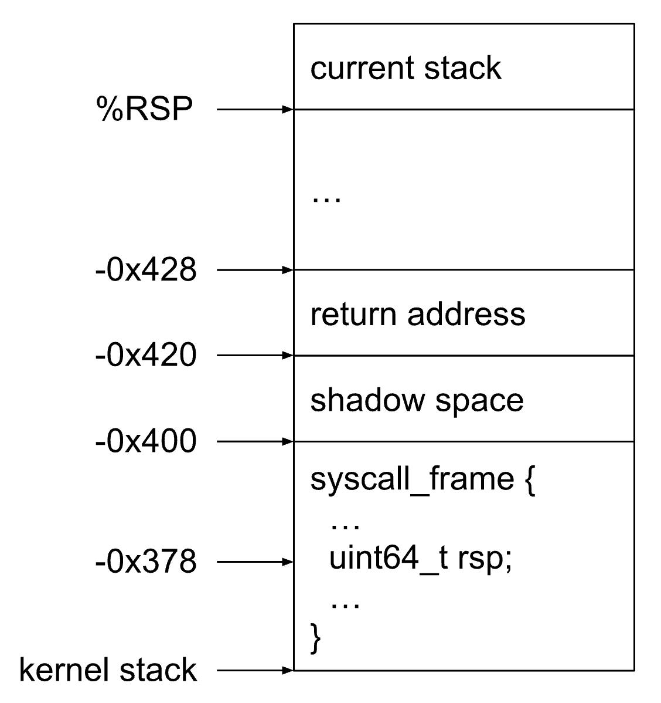

Last year I was working on improving debugging experience for Wine/Proton and part of that work went into supporting process crashdumps. Supporting minidumps was particularly important and of course it turned out things were broken. I worked on this problem more than a year ago and things may have changed since then. This article is a reconstruction of my old notes since I find the story is quite entertaining even if it's not so relevant today.

<!--more-->

---

[Minidump](https://docs.sentry.io/platforms/native/guides/minidumps/) is a binary format that contains the information about the crashed process. It's much smaller than a full coredump, but has enough information to reconstruct the call stacks of all threads. Native Windows applications, when run with Wine/Proton, are running as "real" Linux processes and thus can produce valid core/minidumps upon crash. Or _could_, before Wine 7 happened.

Wine 7+ has changed the way it transitions into the native Linux code – the thread performing a syscall now has a segmented stack: the user-space part (i.e. Windows code) and kernel-space part (i.e. Linux). These two parts are located in different locations in memory and "connected" via a special function called `__wine_syscall_dispatcher` (which is written in pure assembly and doesn't have the CFI information). This causes a problem for tools that reconstruct call stacks. The solution for stack unwind was introduced in <https://gitlab.winehq.org/wine/wine/-/merge_requests/1065>, however minidumps still have a problem – due to the way they are created, they're missing the memory of the user-space (i.e. Windows) part of the stack.

In out setup the minidumps were created via the `linux_core2md` tool, which is a part of the [Breakpad](https://chromium.googlesource.com/breakpad/breakpad/) project. This tool takes a full core dump as a parameter and converts it to the minidump format. The relevant detail for us is how it saves the thread stack memory. The process is quite simple: get the current value of the stack pointer ([src](https://chromium.googlesource.com/breakpad/breakpad/+/master/src/client/linux/minidump_writer/minidump_writer.cc#418)), move the pointer to the bottom of the page and save the 32kb of memory ([src](https://chromium.googlesource.com/breakpad/breakpad/+/master/src/client/linux/minidump_writer/linux_dumper.cc#759)). The algorithm intentionally doesn't involve unwinding the stack, because that's a very heavy and unreliable process (which depends on having symbols, non-corrupted stack, etc). In most cases it works reasonably well, however it falls short when the stack is segmented. Which is exactly the case with Wine/Proton when a syscall is happening (which is also the case when the process is crashing by calling `abort()`).

In order to make minidumps useful again, we need to solve several problems:

1. When writing the minidump, find the location of the second part of the stack.
1. Write it somewhere in the minidump in a way that other tools (e.g. the debugger) can understand it (i.e. it must be conforming to the minidump format).
1. Adjust the tools (e.g. the debugger, breakpad/crashpad processors) to handle the segmented stack when processing the dump and reconstructing the call stack.

You can find the patch to Breakpad implementing the solution in the Appendix of the article. It wasn't merged upstream for understandable reasons (Breakpad itself is no longer actively developed and the solution is just way to hacky), but that's the beauty of open-source -- just hack whatever you want it build it yourself!

## Finding the user-space stack in the coredump

Unfortunately I didn't find a 100% reliable way to find the location of the user-space stack. The best way so far boils down to scanning the current (kernel-space) stack to locate the `syscall_frame` structure and then reading its `rsp` field, which points to the user-space stack. This works reasonably well, but locating `syscall_frame` is quite tricky.

We know that the `syscall_frame` struct is located at the top of the kernel-space stack ([src](https://gitlab.winehq.org/wine/wine/-/blob/master/dlls/ntdll/unix/signal_x86_64.c?ref_type=heads#L2354)). However, we don't know where the top of the stack is. We also know that the kernel stack basically "starts" with `__wine_syscall_dispatcher` performing a function call via the `call` instruction ([src](https://gitlab.winehq.org/wine/wine/-/blob/master/dlls/ntdll/unix/signal_x86_64.c?ref_type=heads#L2701)). Syscall dispatcher follows the x64 ABI calling convention, so it also allocates 32-byte the shadow space before executing a `call`. This means the stack layout looks like this:



```c++
sizeof(struct syscall_frame) == 0x400;
offsetof(struct syscall_frame, rsp) == 0x88;
```

The value of the "return address" is the address of `__wine_syscall_dispatcher` + some offset into it (since the return address points to the location after the `call` instruction inside the function). Luckily, the address of `__wine_syscall_dispatcher` is saved at a fixed offset in memory ([src](https://gitlab.winehq.org/wine/wine/-/blob/master/dlls/ntdll/unix/signal_x86_64.c?ref_type=heads#L2356)):


```c++
0x7ffe1000 = (address of KSHARED_USER_DATA) + PAGE_SIZE = 0x7ffe0000 + 0x1000;
```

So in order to locate the `syscall_frame` struct, we can first get the address of `__wine_syscall_dispatcher` by reading `0x7ffe1000` and then scan the stack looking for something that looks like the return address to it. Once we found it, skip additional 32 bytes (shadow space) and we're at the beginning of the `syscall_frame`! Now skip another 126 bytes (0x88, [src](https://gitlab.winehq.org/wine/wine/-/blob/master/dlls/ntdll/unix/signal_x86_64.c?ref_type=heads#L399)) to get to the `rsp` field.

Tl;dr algorithm for locating the user-space stack:

1. Read `0x7ffe1000` to get the address of `__wine_syscall_dispatcher`
1. Scan the stack and find the location of the return address to `__wine_syscall_dispatcher`
1. Skip 4 + 136 bytes to get to the `syscall_frame.rsp`
1. Read the value, it should point to the user-space stack!

### Alternative 1: unwind via frame pointers

Another viable solution would be to manually unwind the stack by following the frame pointers until we hit the `__wine_syscall_dispatcher` boundary. This approach looks more resilient to changes in the layout of the `syscall_frame` and its location in the stack, however it also relies on having valid frame pointers, which may or may not be present in all libraries.

### Alternative 2: allocate kernel stack below user stack

The problem wouldn't exist if the stack weren't segmented. There was a patch last year that seems to put the kernel stack right below the user stack, so that the memory is located nearby – <https://www.winehq.org/pipermail/wine-devel/2021-September/196608.html>.

I've tried applying the patch locally, but it didn't seem to do what it claimed – the stacks for Windows and Linux parts of the stack were still located in different locations, so the minidumper didn't work. I haven't dug deeper into why the patch doesn't work, it's possible I missed something back then.

## Writing the user-space stack into the minidump

Now that we've found the second part of the stack, we need to save it into the minidump. The minidump stores the information about the threads in the `MINIDUMP_THREAD_LIST` stream, which consists of `MINIDUMP_THREAD` objects:

```c++
typedef struct _MINIDUMP_THREAD {
  ULONG32                      ThreadId;
  ULONG32                      SuspendCount;
  ULONG32                      PriorityClass;
  ULONG32                      Priority;
  ULONG64                      Teb;
  MINIDUMP_MEMORY_DESCRIPTOR   Stack;
  MINIDUMP_LOCATION_DESCRIPTOR ThreadContext;
}
```

The `Stack` field is a memory descriptor, which describes the chunk of memory that contains the thread stack. A memory descriptor is just some meta information + a pointer to the data in the minidump, and all memory descriptors are also saved in the `MINIDUMP_MEMORY_LIST` stream:

```c++
typedef struct _MINIDUMP_MEMORY_LIST {
  ULONG32                    NumberOfMemoryRanges;
  MINIDUMP_MEMORY_DESCRIPTOR MemoryRanges[0];
}
typedef struct _MINIDUMP_MEMORY_DESCRIPTOR {
  ULONG64                      StartOfMemoryRange;
  MINIDUMP_LOCATION_DESCRIPTOR Memory;
}
typedef struct _MINIDUMP_LOCATION_DESCRIPTOR {
  ULONG32 DataSize;
  RVA     Rva;  // Data offset from the beginning of the minidump file.
}
```

The thread structure doesn't allow specifying multiple stack memory regions, but we can save any number of extra memory regions into the `MINIDUMP_MEMORY_LIST` stream. If we're lucky, the tools processing the minudump will be able to understand that. The difference in the layout will look roughly like this:


## Adjusting the tools (LLDB)

Luckily, the LLDB debugger can understand multiple stack segments and works out of the box! Here's an example of Stadia for Visual Studio debugging the minidump from a 64-bit process:


The call stack is correct and the debugger correctly recognizes that the source of the crash is the segmentation fault, which happened in the `foo_segfault()` function.

## Wine WOW64 and 32-bit

For 32-bit processes the story is slightly different. First of all, `linux_core2md` only works for the coredumps of the same bitness! This means that to convert 64-bit coredumps you need to use a 64-bit version of `linux_core2md` and for 32-bit coredumps you need a 32-bit version of `linux_core2md`.

It doesn't seem to be possible to build a single version of `linux_core2md` capable of handling both 64-bit and 32-bit formats due the the nature of ELF APIs it depends on – most of the structs have build-time conditional sizes. For example, `ElfCoreDump` has the following definitions:

```c++
class ElfCoreDump {
 public:
  // ELF types based on the native word size.
  typedef ElfW(Ehdr) Ehdr;
  …

#if ULONG_MAX == 0xffffffff
  static const int kClass = ELFCLASS32;
#elif ULONG_MAX == 0xffffffffffffffff
  static const int kClass = ELFCLASS64;
#else
#error "Unsupported word size for ElfCoreDump."
#endif
```

`ElfW` is defined as follows:

```c++
#ifndef __ELF_NATIVE_CLASS
#  if defined(_M_X64) || defined(__x86_64) || defined(__amd64)
#    define __ELF_NATIVE_CLASS 64
#  else
#    define __ELF_NATIVE_CLASS 32
#  endif
#endif

#define ElfW(type)        _ElfW (Elf, __ELF_NATIVE_CLASS, type)
#define _ElfW(e,w,t)        _ElfW_1 (e, w, _##t)
#define _ElfW_1(e,w,t)        e##w##t
```

Therefore, depending on the target architecture, `Ehdr` will be either `Elf32_Ehdr` or `Elf64_Ehdr`, which have [different memory layouts](https://docs.oracle.com/cd/E19120-01/open.solaris/819-0690/chapter6-43405/index.html). Even worse, in some places the code converts raw pointers (e.g. `char*`) to `Elf32_Addr/Elf64_Addr`, which also have different sizes (4 and 8 bytes respectively). So the only reasonable way to solve this is to build `linux_core2md` in 32-bit mode 😢

## Appendix

### Exploring the minidump in ImHex

When debugging and trying to understand the minidump format, it might be useful to look at the data directly in the HEX editor. Just looking at the series of bytes is not fun, so I've written a simple format description for [ImHex](https://github.com/WerWolv/ImHex) – <https://github.com/werat/imhex-minidump>.

With the description loaded, the editor highlights different regions of the file according to the format definitions. It can also format strings and makes it much easier to understand how the data is laid out.


### Patch to Breakpad implementing the solution

When maintaining private non-upstreamable patches, it's very important to keep them as conflict-free as possible. This makes upgrades much easier and keeps the maintainers happy. The parent for this patch is <https://chromium.googlesource.com/breakpad/breakpad/+/0808030bee8bc88a34675cd1dd83b965a2249a08>, although I'm pretty sure it should apply to the current HEAD without any issues.

```c++
--- a/breakpad/src/client/linux/minidump_writer/minidump_writer.cc
+++ b/breakpad/src/client/linux/minidump_writer/minidump_writer.cc
@@ -320,6 +320,92 @@
     return true;
   }

+  bool IsWine64Process() {
+    for (const MappingInfo* mapping : dumper_->mappings()) {
+      if (strstr(mapping->name, "/wine64-preloader")) {
+        return true;
+      }
+    }
+    return false;
+  }
+
+  bool AddressBelongsTo(uint64_t addr, const char* module) {
+    for (const MappingInfo* mapping : dumper_->mappings()) {
+      if (strstr(mapping->name, module)) {
+        return addr >= mapping->system_mapping_info.start_addr &&
+               addr <= mapping->system_mapping_info.end_addr;
+      }
+    }
+    return false;
+  }
+
+  void FillWindowsPartOfTheStack(uint32_t tid,
+                                 uint8_t* linux_stack_ptr,
+                                 size_t stack_len) {
+    // In Wine 7 the size of the __wine_syscall_dispatcher is 643 (0x283) bytes.
+    // The return address should point inside the function, but give the offset
+    // a little bit of leeway just in case.
+    constexpr uint64_t kDispatcherMaxOffset = 0x320;
+
+    // First find out the address of __wine_syscall_dispatcher
+    uint64_t dispatcher_addr;
+    // 0x7ffe1000 = &KSHARED_USER_DATA + PAGE_SIZE = 0x7ffe0000 + 0x1000;
+    if (!dumper_->CopyFromProcess(&dispatcher_addr, tid,
+                                  (void*)0x7ffe1000, 8)) {
+      return;
+    }
+    // __wine_syscall_dispatcher should be defined in ntdll.so, verify that.
+    if (!AddressBelongsTo(dispatcher_addr, "/ntdll.so")) {
+      return;
+    }
+
+    // Now scan the stack looking for something that looks like return address
+    // to the __wine_syscall_dispatcher.
+    for (uint8_t* p = linux_stack_ptr; p < linux_stack_ptr + stack_len; ++p) {
+      // %rip should be `__wine_syscall_dispatcher+offset`.
+      uint64_t rip = *reinterpret_cast<uint64_t*>(p);
+      if (rip - dispatcher_addr > kDispatcherMaxOffset) {
+        continue;
+      }
+      // Found something that looks like a return address pointing into the
+      // __wine_syscall_dispatcher(). Now skip some bytes to get to the
+      // `syscall_frame` struct that contains the pointer to the Windows stack.
+
+      // Skip 8 bytes -- size of %rip.
+      p += 8;
+      // Skip 32 bytes -- shadow space according to the x64 calling convention.
+      p += 32;
+      // Skip 136 bytes to get to the syscall_frame->rsp:
+      //   offsetof(struct syscall_frame, rsp) == 0x88
+      p += 136;
+      // Read the value of %rsp, this should point to the Windows stack.
+      uint64_t rsp = *reinterpret_cast<uint64_t*>(p);
+
+      // Copy the Windows stack as a separate memory region.
+      const void* stack_ptr;
+      size_t len;
+      if (!dumper_->GetStackInfo(&stack_ptr, &len, rsp)) {
+        return;
+      }
+
+      uint8_t* stack_data = reinterpret_cast<uint8_t*>(Alloc(len));
+      if (!dumper_->CopyFromProcess(stack_data, tid, stack_ptr, len)) {
+        return;
+      }
+
+      MDMemoryDescriptor md;
+      UntypedMDRVA memory(&minidump_writer_);
+      if (!memory.Allocate(len))
+        return;
+      memory.Copy(stack_data, len);
+      md.start_of_memory_range = reinterpret_cast<uintptr_t>(stack_ptr);
+      md.memory = memory.location();
+      memory_blocks_.push_back(md);
+
+      break;
+    }
+  }
+
   bool FillThreadStack(MDRawThread* thread, uintptr_t stack_pointer,
                        uintptr_t pc, int max_stack_len, uint8_t** stack_copy) {
     *stack_copy = NULL;
@@ -375,6 +461,11 @@
       thread->stack.start_of_memory_range = reinterpret_cast<uintptr_t>(stack);
       thread->stack.memory = memory.location();
       memory_blocks_.push_back(thread->stack);
+
+      // Mega-hack for processes running with Wine 7+.
+      if (IsWine64Process()) {
+        FillWindowsPartOfTheStack(thread->thread_id, *stack_copy, stack_len);
+      }
     }
     return true;
   }
```
